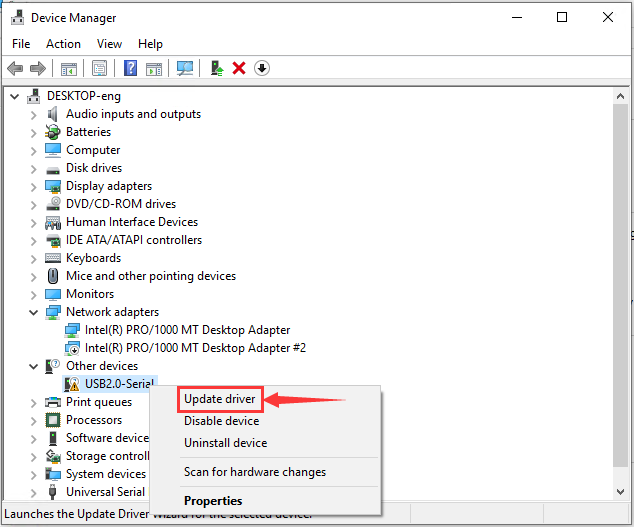

# **Keyestudio Frog Robot for Arduino Graphical Programming Arduino Tutorial**


## Read me frist

 **Download the APP, Code and library from the link: <https://fs.keyestudio.com/KS0446>**
 
***
## About the tutorial

What an amazing Otto Frog Robot is coming!

This kit provides a perfect opportunity to build your very first robot, and it makes the process of learning about robotics easy, interactive, and FUN!

The kit is based on the keyestudio nano ch340, compatible with both Arduino open-source platform and Mixly Blocks coding.

You can program your own robot to walk, dance and follow obstacle, easy to build and code. No prior tech experience required!

Through play and experimentation children can exercise computational thinking and put skills into practice that are necessary for problem solving.


## Features

-   Voltage input: DC 7-12V

-   Ultrasonic module for measuring the front obstacle distance, forming obstacle avoiding system;
    
-   Pairing HM-10 Bluetooth module with mobile Bluetooth to navigate the frog robot;
    
-   Providing the mobile APP compatible with both Android and mac system;

-   The NANO shield extends 12 digital pins and 8 analog pins into 3pin header, easy to connect a couple of sensor modules for projects extension;
    
-   The NANO shield comes with an I2C communication pin, able to connect I2C communication module for experiment extension.


## Parts List

In this keyestudio frog robot kit package, you’ll receive all the components needed to build your own robot, easy to code and learn to play.

|  #   |                             NAME                             | QTY  |                             PIC                              |
| :--: | :----------------------------------------------------------: | :--: | :----------------------------------------------------------: |
|  1   |                    Keyestudio nano ch340                     |  1   |                      |
|  2   |      AM/mini5P transparent blue OD:5.0 L=30cm USB cable      |  1   |                      |
|  3   |                    keyestudio NANO shield                    |  1   |                      |
|  4   | Keyestudio HM-10 Bluetooth-4.0 V3 compatible with HC-06 pins |  1   |                      |
|  5   |                  HC-SR04 Ultrasonic sensor                   |  1   |                      |
|  6   |  18650 2-cell Battery case with JST-PH2.0MM-2P lead(115MM)   |  1   |  |
|  7   |                 M1.6\*10MM round-head screw                  |  4   |  |
|  8   |                 M1.6 304 stainless steel nut                 |  4   |               |
|  9   |                   M3\*6MM round-head screw                   |  16  |                                             |
|  10  |                  M3\*10MM round-head screw                   |  10  |               |
|  11  |                   M3\*10MM flat-head screw                   |  3   |               |
|  12  |                    M3 nickel plating nut                     |  14  |               |
|  13  |                  M2\*10MM round-head screw                   |  8   |               |
|  14  |                    M2 nickel plating nut                     |  12  |               |
|  15  |                    M1.2X5MM tapping screw                    |  12  |               |
|  16  |                   M3 304 self-locking nut                    |  2   |  |
|  17  |                      Dual-pass M3\*10MM                      |  4   |               |
|  18  |                      Dual-pass M3\*30MM                      |  4   |               |
|  19  | Acrylic plate 3PCS  215\*120MM T=3MM  transparent green environmental protection |  1   |                                         |
|  20  |         Servo MG90S（14g）23\*12.2\*29mm(black) 180°         |  4   |                                             |
|  21  |              Female to female 10CM Jumper wire               |  20  |  |
|  22  |      yellow and black Handle 3\*40MM cross screwdriver       |  1   |  |
|  23  |   Transparent red film acrylic double-sided adhesive tape    |  1   |  |
|  24  |                        Flange bearing                        |  2   |                      |

## Install Arduino IDE and Driver

**Download Arduino IDE**

When getting this control board, we need to install Arduino IDE Navigate the website <https://www.arduino.cc/>

Clickand


Select the version you want to download, the latest version could be downloaded.


We will demonstrate how to download Arduino IDE in Windows system.

You could click to download an installer of Arduino 1.8.13 version, which needs to be installed manually.

When you tap，a zip file of Arduino 1.8.13 version will be directly downloaded, and you only need to unzip it to finish installation.


Click  to download an installer of Arduino 1.8.12 version，which needs to be installed manually. When you tap，a zip file of Arduino 1.8.12 version will be directly downloaded, and you only need to unzip it to finish installation.


Click icon to download Arduino IDE.

Install Arduino IDE

Double-click arduino-1.8.13-windows.exe，and click I Agree.


Click the components( Insall Arduino software）you want to install, and click Next to continue.


Click Browse and select the folder where **Arduino IDE file locates** and click Install.


Wait for a while and click Close.


**Install Driver**

Let’s install driver after the download is finished. The USB to serial port chip of this control board is CH340G. So you need to install the driver for the chip.

If your computer is Windows10，connect the board to your computer, right-click*“Computer”—\>“Properties”—\>“Device manager”*,

You could view“USB2.0-Serial”below“Other Devices”.


After a while, the driver USB-SERIAL CH340 will be installed automatically.

If not, you need to install manually, right-click“**USB2.0-Serial**”and tap “**Update Driver**”-\>“**Search automatically for updataed driver software**”.

Then wait for installation and click“Close”




Right-click “Computer” —\>“Properties”—\>“Device manager”, and tap port to check.


If your PC is not Windows 10, you will need to install manually.

Go to KS0446 Keyestudio.... Programming folder→Resources→usb_ch341_3.1.2009.06 

We need to use driver usb_ch341_3.1.2009.06.


When you connect the board to your computer at the first time, right click the icon of your “Computer” —\>for “Properties”—\> click “Device manager”, under “Other Devices”, you should see an icon for “USB2.0-Serial” with a little yellow warning triangle next to it.


Then right-click on the device and select the top menu option (Update Driver Software...) shown as the figure below.


It will then be prompted to either “Search Automatically for updated driver software” or “Browse my computer for driver software”. Shown as below. In this page, select “Browse my computer for driver software”.


Click Browse to navigate the driver folder, select“usb_ch341_3.1.2009.06”folder and“OK”(we put“usb_ch341_3.1.2009.06”folder in the KS0446.....programming folder)


Click“Next”，once the software was installed, you will get a confirmation message. Click“Close”after installation completed.


Up to now, the driver is installed well. Then you can right click *“Computer” —\>“Properties”—\>“Device manager”*, you should see the device as the figure shown below.


**Arduino IDE Setting**

Clickicon，open Arduino IDE.


To avoid the errors when uploading the program to the board, you need to select the correct Arduino board that matches the board connected to your computer.

Then come back to the Arduino software, you should click Tools→Board, select the board.(the development board we use is NANO board, therefore, select **Arduino Nano**)


Then select the correct COM port (you can see the corresponding COM port after the driver is successfully installed)


Before uploading the program to the board, let’s demonstrate the function of each symbol in the Arduino IDE toolbar.


A- Used to verify whether there is any compiling mistakes or not.

B- Used to upload the sketch to your Arduino board.

C- Used to create shortcut window of a new sketch.

D- Used to directly open an example sketch.

E- Used to save the sketch.

F- Used to send the serial data received from board to the serial monitor.

## Start Programming

Open the file to select Example, choose BLINK from BASIC, as shown below:


Set board and COM port, the corresponding board and COM port are shown on the lower right of IDE.


Clickto start compiling the program, and check errors.


Clickto upload the program, upload successfully.


Upload the program successfully, the on-board LED lights on for 1s, goes off for 1s. Congratulation, you finish the first program.

## How to Install Library

**What are Arduino Libraries**

[Libraries](https://www.arduino.cc/en/Reference/Libraries) are a collection of code that makes it easy for you to connect to a sensor,display, module, etc.

For example, the built-in LiquidCrystal library makes it easy to talk to character LCD displays. There are hundreds of additional libraries available on the Internet for download.

The built-in libraries and some of these additional libraries are listed in the reference. To use the additional libraries, you will need to install them.

**How to Install Library**

Here we will introduce the most simple way for you to add libraries .

**Step 1:** After download well the Arduino IDE, you can right-click the icon of Arduino IDE.

Find the option "Open file location" shown as below.


**Step 2:** Find out libraries folder, the library file of Arduino.


**Step 3：**Next to find out the“libraries”folder of frog robot(seen in the link: https://fs.keyestudio.com/KS0446)


Click and tap “Libraries”


Copy the above libraries into libraries of Arduino IDE.


The libraries of frog robot are well installed.

## Hardware Projects

As you work your way through each project, you will learn to how to program the robot to move, dance, and follow obstacles.

### Project 1: Keyestudio NANO CH340


**Introduction:**

The keyestudio Nano CH340 is a small, complete, and breadboard-friendly board based on the ATmega328P-AU. Compared with ARDUINO NANO, the USB-to-serial port chip used in keyestudio Nano is CH340G, so that the using method is the same except the driver installation file.

It has 14 digital input/output pins (of which 6 can be used as PWM outputs), 8 analog inputs, a 16 MHz crystal oscillator, a mini USB port, an ICSP header and a reset button.

The keyestudio Nano can be powered via the Mini-B USB connection, or female headers Vin/GND (DC 7-12V).

**Note:**

You can click the link to check out how to test the keyestudio Nano CH340: https://wiki.keyestudio.com/Ks0173_keyestudio_Nano_ch340

**TECH SPECS:**

|       Microcontroller       |                ATmega328P-AU                 |
| :-------------------------: | :------------------------------------------: |
|      Operating Voltage      |                      5V                      |
| Input Voltage (recommended) |                   DC7-12V                    |
|      Digital I/O Pins       | 14 (D0-D13)  (of which 6 provide PWM output) |
|    PWM Digital I/O Pins     |         6 (D3, D5, D6, D9, D10, D11)         |
|      Analog Input Pins      |                  8 (A0-A7)                   |
|   DC Current per I/O Pin    |                    40 mA                     |
|        Flash Memory         |    32 KB of which 2 KB used by bootloader    |
|            SRAM             |                     2 KB                     |
|           EEPROM            |                     1 KB                     |
|         Clock Speed         |                    16 MHz                    |
|         LED_BUILTIN         |                     D13                      |

**Element and Interfaces:**

Here is an explanation of what every element and interface of the board does:


|        |                  PIN                   | FUNCTION                                                     |
| ------ | :------------------------------------: | ------------------------------------------------------------ |
| **1**  |            **ICSP Header**             | **ICSP (In-Circuit Serial Programming) Header** ICSP is the AVR, an micro-program header consisting of MOSI, MISO, SCK, RESET, VCC, and GND. It is often called the SPI (serial peripheral interface) and can be considered an "extension" of output. In fact, slave the output devices under the SPI bus host. When connecting to PC, program the firmware to ATMEGA328P-AU. |
| **2**  |      **LED indicator** **（RX）**      | Onboard you can find the label: RX(receive ) When control board communicates via serial port, receive the message, RX led flashes. |
| **3**  |      **LED indicator** **（TX）**      | Onboard you can find the label: TX (transmit) When control board communicates via serial port, send the message, TX led flashes. |
| **4**  |     **LED indicator** **（POW）**      | Power up the control board, LED on, otherwise LED off.       |
| **5**  |      **LED indicator** **（L）**       | There is a built-in LED driven by digital pin 13. When the pin is HIGH value, the LED is on, when the pin is LOW, it's off. |
| **6**  | **RX0（D0）** **TX1（D1）** **D2-D13** | It has 14 digital input/output pins D0-D13 (of which 6 can be used as PWM outputs). These pins can be configured as digital input pin to read the logic value (0 or 1). Or used as digital output pin to drive different modules like LED, relay, etc. |
| **7**  |                **RST**                 | Reset pin: connect external button. The function is the same as RESET button. |
| **8**  |             **MEGA 328P**              | Each board has its own microcontroller. You can regard it as the brain of your board. Microcontrollers are usually from ATMEL. Before you load a new program on the Arduino IDE, you must know what IC is on your board. This information can be checked at the top surface of IC. The board’s microcontroller is ATMEGA328P-AU.  More info. see the [datasheet](http://101.96.10.64/ww1.microchip.com/downloads/en/DeviceDoc/Atmel-42735-8-bit-AVR-Microcontroller-ATmega328-328P_Summary.pdf) |
| **9**  |              **MINI USB**              | The board can be powered via Mini-B USB connection. Also upload the program to the board via USB port. |
| **10** |              **3V3 pin**               | Provides 3.3V voltage output                                 |
| **11** |                **REF**                 | Reference external voltage (0-5 volts) for the analog input pins. Used with [analogReference()](https://www.arduino.cc/reference/en/language/functions/analog-io/analogreference/). |
| **12** |               **A0-A7**                | The Nano has 8 Analog Pins, labeled A0 through A7.           |
| **13** |               **5V pin**               | Provides 5V voltage output                                   |
| **14** |                **GND**                 | Ground pin                                                   |
| **15** |                **VIN**                 | Input an external voltage DC7-12V to power the board.        |
| **16** |          **Reset** **Button**          | Used to reset the control board                              |
| **17** |               **CH340G**               | USB-to-serial port chip, converting the USB signal into Serial port signal. |
| **18** |              **AMS1117**               | Convert the external voltage input DC7-12V into DC5V, then transfer it to the processor and other elements. |

**Specialized Functions of Some Pins:**

-   **Serial communication:** 0 (RX) and 1 (TX). Used to receive (RX) and transmit (TX) TTL serial data.
    
-   **PWM (Pulse-Width Modulation):** D3, D5, D6, D9, D10, D11

-   **External Interrupts:** D2 (interrupt 0) and D3 (interrupt 1). These pins can be configured to trigger an interrupt on a low value, a rising or falling edge, or a change in value. See the attachInterrupt() function for details.
    
-   **SPI communication:** D10 (SS), D11 (MOSI), D12 (MISO), D13 (SCK).

-   **IIC communication:**  A4 (SDA); A5(SCL)

### Project 2: keyestudio NANO Shield


**Overview**

keyestudio Nano ch340 is a tiny control board based on Arduino platform, which is deeply popular.

However, if want to connect several sensor modules to keyestudio Nano ch340, and connect external power, we need to use breadboard and a bunch of jumper wires, which is pretty inconvenient.

We specially design this NANO shield, fully compatible with keyestudio Nano ch340.

The NANO shield has brought out digital and analog pins of keyestudio Nano ch340 into 3PIN headers (GND, 5V, Signal) with pin pitch of 2.54mm.

The NANO shield also leads out frequently-used communication pins, such as serial port communication and I2C communication. It’s greatly easy to connect keyestudio Nano ch340 and other sensor modules.

It comes with a power indicator and a reset button as well.


For external power, the NANO shield comes with a PH2.0-2P connector (input DC7-12V); a Power_Switch for power control.

To supply power for other sensors, the NANO shield comes with a 3-way DC3.3V power output pin header with pin pitch of 2.54mm.

It comes with 4 fixing holes with a diameter of 3mm, so easy to mount on other devices.

**Features**

1.  Extends 12 digital pins into 3pin header

2.  Extends 8 analog pins into 3pin header

3.  Comes with a serial communication pin header (for Bluetooth module)

4.  Comes with an I2C communication pin

5.  Comes with 3-way DC 3.3V power output pin

6.  Comes with a power indicator and a reset button

7.  Comes with an external power connector（PH2.0-2P）and a control button


**Technical Parameters**

-   Voltage input: DC7-12V

-   Power connector: PH2.0-2P

-   Pin/Female header: 2.54mm

-   Fixing hole diameter: 3mm

-   Dimensions: 57mm\*54mm\*17mm

-   Weight: 20.4g

**Controller Compatible**

-   keyestudio Nano ch340

**PINOUTS**


Simply stack the keyestudio Nano ch340 into the keystudio NANO shield. Supply the power with batteries via white connector.


### Project 3: Adjusting Servo Angle

Introduction

In the process of frog robot DIY, the frog robot has a 180° servomotor at each joint. We can control the servomotor at each joint to rotate at different angles, thus controlling the frog robot to run different actions.

In this course we focus on the principle and usage of the servomotor in the frog robot kit.

The servomotor is a position servo driver that can rotate between 0 and 180 degrees. If you want your robot assistant to help you get a book, the robot arm rotation angle is too big or too small, so that can't pick up the book. Only the angle is just right, it can complete the task of taking the book, so can accurately control the angle.

Servo motor is a position control rotary actuator. It mainly consists of housing, circuit board, core-less motor, gear and position sensor.


Included with your servo motor you will find a variety of black mounts that connect to the shaft of your servo.

You may choose to attach any mount you wish for the circuit. It will serve as a visual aid, making it easier to see the servo spin.

**Working principle**

The receiver or MCU outputs a signal to the servomotor. The motor has a built-in reference circuit that gives out reference signal, cycle of 20ms and width of 1.5ms. The motor compares the acquired DC bias voltage to the voltage of the potentiometer and outputs a voltage difference.

Servo motor comes with many specifications. But all of them have three connection wires, distinguished by brown, red, orange colors (different brand may have different color).

Brown one is for GND, red one for power positive, orange one for signal line.


The rotation angle of servo motor is controlled by regulating the duty cycle of PWM (Pulse-Width Modulation) signal. The standard cycle of PWM signal is 20ms (50Hz).

Theoretically, the width is distributed between 1ms-2ms, but in fact, it's between 0.5ms-2.5ms. The width corresponds the rotation angle from 0° to 180°.

But note that for different brand motor, the same signal may have different rotation angle.


We can set the HIGH/LOW for corresponding pins in the Mixly blocks software, so as to adjust the servo angle; furthermore, we specially create the robot library, so easy to control the servo angle with simplified code.

**Connection Diagram**

Simply stack the keyestudio Nano ch340 into the keystudio NANO shield.

Connect the Servo pin to digital pin 4


**Source Code**

Test the angle that servo motor moves between 0°and 180°

```c
#include <Servo.h>

Servo servo_4; //Instantiate servos

void setup(){

servo_4.attach(4); //Connect the signal wire(yellow) to digital 4

}

void loop(){
	for (int i = 0; i <= 180; i = i + (1)) { //the variable i is used to save thelocation of the servo, from 0° to 180°，the step length is 1
		servo_4.write(i); //make the servo to rotate the location of variable i
		delay(200); //wait for 200ms to make the servo to rotate the location ofvariable i 
    }

	for (int i = 180; i >= 0; i = i + (-1)) { //the variable i is used to save the location of the servo, from 0° to 180°, the step length is 1
        servo_4.write(i); //make the servo to rotate the location of variable i
        delay(200); //wait for 200ms to make the servo to rotate the location of variable i 
    }
}
```

**Test Result**

Upload the Code success, press down the Power_Switch, the servo motor will rotate back and forth from 0°to 180°.

**Code explanation**

**\##include \<Servo.h\>**It is the Servo function and statement of Arduino.

1.  attach（port）——Set the port of the servo

2.  write（angle）——The statement used to set the rotation angle of the servo. The range of the angle that can be set is 0° to 180°.
    
3.  read（）——The statement used to read the angle of the steering gear can be understood as reading the value in the last write() command.attached（）——Determine whether the servo parameters have been sent to the interface where the servo is located.
    
4.  Note: the above statement writing format is servo variables names like myservo.attach(4)

**Extension Practice:**

Refer to the test code. Try to reset the servo pin and rotation speed (Tips: set the delay time for servo angle ; or adjust to increase/reduce the step, which should be divisible by 180, like 2, 3, 5.)


```c
#include <Servo.h>

Servo servo_4; //Instantiate servos

void setup(){
	servo_4.attach(4); //Connect the signal wire(yellow) to digital 4
}

void loop(){

	for (int i = 0; i <= 180; i = i + (1)) { //the variable i is used to save thelocation of the servo, from 0° to 180°， the step length is 1
		servo_4.write(i); //make the servo to rotate the location of variable i
		delay(1000); //wait for 1000ms, the servo rotate the location of the variable i
}

	for (int i = 180; i >= 0; i = i + (-1)) { //the variable i is used to save thelocation of the servo, from 0° to 180°, the step length is 1
	servo_4.write(i); //make the servo to rotate the location of variable i
	delay(1000); //wait for 1000ms, the servo rotate the location of the variable i
	}
}
```

```c
#include <Servo.h>

Servo servo_4; //Instantiate servos

void setup(){
	servo_4.attach(4); //Connect the signal wire(yellow) to digital 4
}

void loop(){
	for (int i = 0; i <= 180; i = i + (20)) { //the variable i is used to save thelocation of the servo, from 0° to 180°, the step length is 20
		servo_4.write(i); //make the servo to rotate the location of variable i
		delay(200);//wait for 200ms to make the servo to rotate the location of variable i 
    }

	for (int i = 180; i >= 0; i = i + (-20)) { //the variable i is used to save thelocation of the servo, from 0° to 180°, the step length is 20
		servo_4.write(i); //make the servo to rotate the location of variable i
		delay(200); //wait for 200ms to make the servo to rotate the location ofvariable i 
    }
}
```

### Project 4: Ultrasonic Detecting Obstacles

Introduction：

The ultrasonic module will emit the ultrasonic waves after trigger signal. When the ultrasonic waves encounter the object and are reflected back, the module outputs an echo signal, so it can determine the distance of object from the time difference between trigger signal and echo signal.

We can use the ultrasonic sensor to detect whether there is an obstacle ahead. It is commonly used to measure the distance between the front obstacle and robot.

In the process of robot DIY, we can use the measured distance by ultrasonic sensor to build functional robots, such as automatic avoiding, following, etc.

In the experiment, we use the ultrasonic sensor to measure the distance between the robot and front obstacle.

The following picture is an ultrasonic module.


**Specifications:**

-   Operating voltage: DC 5V

-   Operating current: 15mA

-   Operating frequency: 40khz

-   Maximum detection range: 3-5m

-   Minimum detection range: 2cm

-   Induction Angle: less than 15 degrees

-   High accuracy: up to 3mm

**Wiring：**


Connect the ultrasonic sensor to NANO shield, VCC pin to 5V(V), Trig pin to digital 6 (S), Echo pin to digital 7 (S), GND pin to GND(G); Then stack the NANO CH340 into the NANO shield.

**Test Code:**

```c
float checkdistance() { //distance measuring function

//Generate a 10us high pulse to trigger TrigPin
	digitalWrite(6, LOW); //Set pin 6 output voltage low
	delayMicroseconds(2); //delay in 20ms
	digitalWrite(6, HIGH); //Set pin 6 output voltage high
	delayMicroseconds(10); //delay in 10ms
	digitalWrite(6, LOW); //Set pin 6 output voltage low

	// Detect pulse width and calculate distance
	float distance = pulseIn(7, HIGH) / 58.00; // Read the high pulse on pin 7,divide the maximum pulse time by 58.00, and assign the result to the distancevariable as a floating value 
    delay(10); // delay in 10ms
	return distance; //return the distance value

}

void setup(){
	Serial.begin(9600); //open the serial port, set the data transmission speed to 9600bps
	pinMode(6, OUTPUT); //Initialize digital pin 6 to output mode, connect to Trigof ultrasonic sensor
	pinMode(7, INPUT); //set the digital 7 to output, and connect the Eco of theultrasonic sensor
	Serial.begin(9600);
}

void loop(){
	Serial.println(checkdistance()); //output checkdistance via the serial port()
	delay(200); //delay in 200ms
}
```

**Test Result**:

Upload the code success, press the Power_Switch on NANO shield.

Open the **Monitor**  and set **the baud rate to 9600**.

Move your hand or a large, flat object closer and farther away from the ultrasonic sensor. As the object approaches, the monitor will show the distance (unit:cm) being read from the sensor.


**Code explanation**:

float distance = pulseIn(7, HIGH) / 58.00

The pulseIn function is actually a simple function to measure the pulse width, and the default unit is us. That is to say, what pulseIn measures is the time elapsed from transmitting to receiving ultrasonic waves. The divisor of 58 is also well understood, and the speed of sound in dry, 20°C air is about 343 m/s, or 34,300 cm/s. Or, let's do a unit conversion, divide 34,300 by 1,000,000 cm/microsecond. That is: 0.0343 cm/microsecond, and another angle, 1/(0.0343 cm/microsecond) is: 29.15 microseconds/cm. This means that every 291.5 microseconds represents a distance of 10CM. 1 cm is 29.15 microseconds. But after sending to receiving the echo, the sound travels twice the distance.

So the actual distance is 1 cm, which corresponds to 58.3 microseconds. In fact, the entire ranging process is the time from when the sound wave is sent to the time when the echo is received. The first distance in your program is actually the time us. So to change the distance in cm, divide it by 58. Of course dividing by 58.3 may be more accurate. So we can get the measured distance with pulseIn(7, HIGH) / 58.00.

**Extension Practice:**

**You can add new texts or distance unit (cm) on the monitor display**

```c
float checkdistance() { //distance measuring function

//Generate a 10us high pulse to trigger TrigPin
    digitalWrite(6, LOW); //Set pin 6 output voltage low
    delayMicroseconds(2); //delay in 20ms
    digitalWrite(6, HIGH); //Set pin 6 output voltage high
    delayMicroseconds(10); //delay in 10ms
    digitalWrite(6, LOW); //Set pin 6 output voltage low

// Detect pulse width and calculate distance
	float distance = pulseIn(7, HIGH) / 58.00; // Read the high-level pulse on pin7, divide the maximum pulse time by 58.00, and assign the result to the distancevariable as a floating value 
    delay(10); // delay in 10ms
	return distance; //return the distance value
}

void setup(){

    Serial.begin(9600); //open the serial port, set the data transmission speed to9600bps
    pinMode(6, OUTPUT); //Initialize digital pin 6 to output mode, connect to Trigof ultrasonic sensor
    pinMode(7, INPUT); //set the digital 7 to output, and connect the Eco of theultrasonic sensor
}

void loop(){

    Serial.print(checkdistance()); //Output checkdistance() value through serial    port without wrapping()
    Serial.println("cm"); //Output string "cm" through serial line wrapping
    delay(200); //delay in 200ms

}
```

**Change the baud rate and delay time to see the result**

```c
float checkdistance() { //distance measuring function

    //Generate a 10us high pulse to trigger TrigPin
    digitalWrite(6, LOW); //Set pin 6 output voltage low
    delayMicroseconds(2); //delay in 20ms
    digitalWrite(6, HIGH); //Set pin 6 output voltage high
    delayMicroseconds(10); //delay in 10ms
    digitalWrite(6, LOW); //Set pin 6 output voltage low

    // Detect pulse width and calculate distance
    float distance = pulseIn(7, HIGH) / 58.00; // Read the high-level pulse on pin7, divide the maximum pulse time by 58.00, and assign the result to the distancevariable as a floating value 
    delay(10); // delay in 10ms
    return distance; //return the distance value
}

void setup(){

    Serial.begin(9600); //open the serial port, set the data transmission speed to9600bps
    pinMode(6, OUTPUT); //Initialize digital pin 6 to output mode, connect to Trigof ultrasonic sensor
    pinMode(7, INPUT); //set the digital 7 to output, and connect the Eco of theultrasonic sensor
    Serial.begin(9600);

}

void loop(){

    Serial.println(checkdistance()); //output checkdistance via the serial port()value
    delay(1000); //Delay in 1000ms

}
```

## Robot Projects

Let’s get started to assembling the lovely frog robot to move, dance or even follow objects. Do operate the robot easily with Bluetooth APP!

Follow this easy and simple instruction of how to install and program your Otto Frog Robot!

ROBOT ASSEMBLY

All the parts for building frog robot are included in the kit, assembling them is easy and typically takes around two hours!


**Note:**

Before install the frog robot, first need to regulate the 4 servo motors to 90°

Stack the Nano ch340 onto the Nano shield; connect 4 servo motors to digital pin5,4,3,2 separately.


**Code:**

Upload the code below to turn the 4 servos to 90° (Refer to project 3)

```c
#include <Servo.h>

Servo servo_2; //Instantiate servos2
Servo servo_3; //Instantiate servos3
Servo servo_4; //Instantiate servos4
Servo servo_5; //Instantiate servos5

void setup(){
    servo_2.attach(2); //Connect the signal wire 2 to digital 2
    servo_3.attach(3); //Connect the signal wire 3 to digital 3
    servo_4.attach(4); //Connect the signal wire 4 to digital 4
    servo_5.attach(5); //Connect the signal wire 5 to digital 5
}

void loop(){
    servo_2.write(90); //Set the angle of the servo 2 to 90°
    delay(500); //Delay in 500ms
    servo_3.write(90); //Set the angle of the servo 3 to 90°
    delay(500); //Delay in 500ms
    servo_4.write(90); //set the angle of the servo 4 to 90°
    delay(500); //Delay in 500ms
    servo_5.write(90); //set the angle of the servo 5 to 90°
    delay(500); //Delay in 500ms
}
```

Fix Feet


Fix Legs


Fix Head to Body


Fix Servos to Body


Complete Frog


Wiring

Connect the HC-SR04 ultrasonic sensor to keyestudio NANO shield using 4pin female to female jumper wires. VCC pin to 5V(V), Trig pin to digital 6 (S), Echo pin to digital 7 (S), GND pin to GND(G);

(The ultrasonic sensor wiring can refer to the Project 4)

Connect the signal wire (orange) of 4 servo motors to digital pin5,4,3,2 separately; brown wire to GND(G); red wire to 5V (V).

(The 4 servos wiring can refer to the Project 3)


The 4 servo motors’ wiring figure:

Plug in the Keyestudio HM-10 Bluetooth-4.0 module to pin header TX, RX, GND, 5V on the keyestudio NANO shield.


### Project 5: Walk


**Circuit Design**

After completing the robot assembly, you’ll see the 4 Servo motors on the robot are connected well to the keyestudio Nano ch340 shield.

We have introduced the knowledge of how to adjust the Servo angle.

In the circuit, we are going to make the 4 Servo motors switch different angles using keyestudio Nano ch340 shield, so as to operate the frog robot walk.

**How it works?**

When design the Otto frog robot, should first design the 4 Servo motors’ position and corresponding control pins.

Check the detailed instructions for servo control pins. As the figure shown below.

**Wiring:**

Simply stack the keyestudio Nano ch340 into the keystudio NANO shield.

Connect the Servo pin to digital pin 2, 3, 4, 5 separately.


**Coding:**

```c
#include <Servo.h>
#include <Oscillator.h>
#include <EEPROM.h>
#define N_SERVOS 4
//-- First step: Configure the pins where the servos are attached
/*
         ---------------
        |     O   O     |
        |---------------|
YR 3==> |               | <== YL 2
         ---------------
            ||     ||
            ||     ||
RR 5==>   -----   ------  <== RL 4
         |-----   ------|
*/
#define EEPROM_TRIM false

//Adjust the angle of the starting servo (Note: must be adjusted here)
#define TRIM_RR -5  //right02
#define TRIM_RL 5  //left02
#define TRIM_YR -5  //right01
#define TRIM_YL 0  //left01

//Servo pin
#define PIN_RR 5
#define PIN_RL 4
#define PIN_YR 3
#define PIN_YL 2
#define INTERVALTIME 10.0
Oscillator servo[N_SERVOS];

#include "SR04.h"
#define TRIG_PIN 6   //sending pins of the ultrasonic sensor
#define ECHO_PIN 7   //receiving pins of the ultrasonic sensorSR04 
SR04 sr04 = SR04(ECHO_PIN,TRIG_PIN);
long a;
int i = 0;  
int val = 0;

//each function declaration
void goingUp(int tempo);
void drunk (int tempo);
void noGravity(int tempo);
void kickLeft(int tempo);
void kickRight(int tempo);
void run(int steps, int T=500);
void walk(int steps, int T=1000);
void backyard(int steps, int T=3000);
void backyardSlow(int steps, int T=5000);
void turnLeft(int steps, int T=3000);
void turnRight(int steps, int T=3000);
void moonWalkLeft(int steps, int T=1000);
void moonWalkRight(int steps, int T=1000);
void crusaito(int steps, int T=1000);
void swing(int steps, int T=1000);
void upDown(int steps, int T=1000);
void flapping(int steps, int T=1000);

int t=495;
double pause=0;

//stop
void Stop()
{
  for(int i=0;i<4;i++) servo[i].SetPosition(90);
}

//go back
 void backyard(int steps, int T)
{
  int A[4]= {15, 15, 30, 30};
  int O[4] = {0, 0, 0, 0};
  double phase_diff[4] = {DEG2RAD(0), DEG2RAD(0), DEG2RAD(-90), DEG2RAD(-90)};
  for(int i=0;i<steps;i++)oscillate(A,O, T, phase_diff);
}

//turn left
 void turnLeft(int steps, int T)
{
  int A[4]= {20, 20, 10, 30};
  int O[4] = {0, 0, 0, 0};
  double phase_diff[4] = {DEG2RAD(0), DEG2RAD(0), DEG2RAD(90), DEG2RAD(90)};
  for(int i=0;i<steps;i++)oscillate(A,O, T, phase_diff);
}

//turn right
 void turnRight(int steps, int T)
{
  int A[4]= {20, 20, 30, 10};
  int O[4] = {0, 0, 0, 0};
  double phase_diff[4] = {DEG2RAD(0), DEG2RAD(0), DEG2RAD(90), DEG2RAD(90)};
  for(int i=0;i<steps;i++)oscillate(A,O, T, phase_diff);
}

//go forward
 void walk(int steps, int T)
{
  int A[4]= {15, 15, 30, 30};
  int O[4] = {0, 0, 0, 0};
  double phase_diff[4] = {DEG2RAD(0), DEG2RAD(0), DEG2RAD(90), DEG2RAD(90)};
  for(int i=0;i<steps;i++)oscillate(A,O, T, phase_diff);
}

void oscillate(int A[N_SERVOS], int O[N_SERVOS], int T, double phase_diff[N_SERVOS]){
  for (int i=0; i<4; i++) {
    servo[i].SetO(O[i]);
    servo[i].SetA(A[i]);
    servo[i].SetT(T);
    servo[i].SetPh(phase_diff[i]);
  }
  double ref=millis();
   for (double x=ref; x<T+ref; x=millis()){
     for (int i=0; i<4; i++){
        servo[i].refresh();
     }
  }
}

unsigned long final_time;
unsigned long interval_time;
int oneTime;
int iteration;
float increment[N_SERVOS];
int oldPosition[]={90,90,90,90};

void moveNServos(int time, int  newPosition[]){
  for(int i=0;i<N_SERVOS;i++) increment[i] = ((newPosition[i])-oldPosition[i])/(time/INTERVALTIME);
  final_time =  millis() + time;
  iteration = 1;
  while(millis() < final_time){ //Javi del futuro cambia esto
      interval_time = millis()+INTERVALTIME;
      oneTime=0;
      while(millis()<interval_time){
          if(oneTime<1){
              for(int i=0;i<N_SERVOS;i++){
                  servo[i].SetPosition(oldPosition[i] + (iteration * increment[i]));
              }
              iteration++;
              oneTime++;
          }
      }
  }

  for(int i=0;i<N_SERVOS;i++){
    oldPosition[i] = newPosition[i];
  }
}

void setup(){
  Serial.begin(9600);
  servo[0].attach(PIN_RR);
  servo[1].attach(PIN_RL);
  servo[2].attach(PIN_YR);
  servo[3].attach(PIN_YL);
  int trim;
  if(EEPROM_TRIM){
    for(int x=0;x<4;x++){
      trim=EEPROM.read(x);
      if(trim>128)trim=trim-256;
      Serial.print("TRIM ");
      Serial.print(x);
      Serial.print(" en ");
      Serial.println(trim);
      servo[x].SetTrim(trim);
    }
  }
  else{
    servo[0].SetTrim(TRIM_RR);
    servo[1].SetTrim(TRIM_RL);
    servo[2].SetTrim(TRIM_YR);
    servo[3].SetTrim(TRIM_YL);
  }
  for(int i=0;i<4;i++) servo[i].SetPosition(90);
}

void loop(){
  walk(5,2*t);  //Take 5 steps forward at a speed of 2*t
  backyard(5,2*t);  //Take 5 steps back at a speed of 2*t
  Stop();    //stop
  delay(1000); //Delay in 1000ms
  turnLeft(5,2*t);  // turn left for five steps in 2*t
  turnRight(5,2*t);  //turn right for five steps in  2*t
  Stop();    //stop
  delay(1000);  //Delay in 1000ms
}

```

**Note:** should upload the code success first, then plug in Bluetooth module. Otherwise, code upload fails.

**Result**

Done uploading the code, press down the Power_Switch on Nano Shield.

The Otto frog robot is ready to walk 5 steps forward, back 5 steps, keep standing for 1 second, turn left for 5 steps, turn right for 5 steps, keep standing for 1 second, alternately and loop.


### Project 6: Dance


**Circuit Design**

Based on the robot walks circuit, we are able to use the same electrical components and wiring method. Just change the code to make the frog robot dance.

**Wiring**

Stack the Nano ch340 onto the Nano shield;

Connect 4 servo motors to digital pin5,4,3,2 separately.


**Code**

```c
#include <Servo.h>
#include <Oscillator.h>
#include <EEPROM.h>
#define N_SERVOS 4
//-- First step: Configure the pins where the servos are attached
/*
         ---------------
        |     O   O     |
        |---------------|
YR 3==> |               | <== YL 2
         ---------------
            ||     ||
            ||     ||
RR 5==>   -----   ------  <== RL 4
         |-----   ------|
*/
#define EEPROM_TRIM false

//adjust the initial angles of servos
#define TRIM_RR (-5)  //right02
#define TRIM_RL 5  //left02
#define TRIM_YR (-5)  //right01
#define TRIM_YL 0  //left01

//pins of the servo
#define PIN_RR 5
#define PIN_RL 4
#define PIN_YR 3
#define PIN_YL 2
#define INTERVALTIME 10.0
Oscillator servo[N_SERVOS];

#include "SR04.h"
#define TRIG_PIN 6  //sending pins of the ultrasonic sensor
#define ECHO_PIN 7  //receiving pins of the ultrasonic sensor
SR04 sr04 = SR04(ECHO_PIN,TRIG_PIN);
long a;
int i = 0;
int val = 0;

//each function declaration
void goingUp(int tempo);
void drunk (int tempo);
void noGravity(int tempo);
void kickLeft(int tempo);
void kickRight(int tempo);
void run(int steps, int T=500);
void walk(int steps, int T=1000);
void backyard(int steps, int T=3000);
void backyardSlow(int steps, int T=5000);
void turnLeft(int steps, int T=3000);
void turnRight(int steps, int T=3000);
void moonWalkLeft(int steps, int T=1000);
void moonWalkRight(int steps, int T=1000);
void crusaito(int steps, int T=1000);
void swing(int steps, int T=1000);
void upDown(int steps, int T=1000);
void flapping(int steps, int T=1000);

int t=495;
double pause=0;

//stop
void Stop()
{
  for(int i=0;i<4;i++) servo[i].SetPosition(90);
}

//go back
 void backyard(int steps, int T)
{
  int A[4]= {15, 15, 30, 30};
  int O[4] = {0, 0, 0, 0};
  double phase_diff[4] = {DEG2RAD(0), DEG2RAD(0), DEG2RAD(-90), DEG2RAD(-90)};
  for(int i=0;i<steps;i++)oscillate(A,O, T, phase_diff);
}

//go forward
 void walk(int steps, int T)
{
  int A[4]= {15, 15, 30, 30};
  int O[4] = {0, 0, 0, 0};
  double phase_diff[4] = {DEG2RAD(0), DEG2RAD(0), DEG2RAD(90), DEG2RAD(90)};
  for(int i=0;i<steps;i++)oscillate(A,O, T, phase_diff);
}

void oscillate(int A[N_SERVOS], int O[N_SERVOS], int T, double phase_diff[N_SERVOS]){
  for (int i=0; i<4; i++) {
    servo[i].SetO(O[i]);
    servo[i].SetA(A[i]);
    servo[i].SetT(T);
    servo[i].SetPh(phase_diff[i]);
  }
  double ref=millis();
   for (double x=ref; x<T+ref; x=millis()){
     for (int i=0; i<4; i++){
        servo[i].refresh();
     }
  }
}

unsigned long final_time;
unsigned long interval_time;
int oneTime;
int iteration;
float increment[N_SERVOS];
int oldPosition[]={90,90,90,90};

void moveNServos(int time, int  newPosition[]){
  for(int i=0;i<N_SERVOS;i++) increment[i] = ((newPosition[i])-oldPosition[i])/(time/INTERVALTIME);
  final_time =  millis() + time;
  iteration = 1;
  while(millis() < final_time){ //Javi del futuro cambia esto
      interval_time = millis()+INTERVALTIME;
      oneTime=0;
      while(millis()<interval_time){
          if(oneTime<1){
              for(int i=0;i<N_SERVOS;i++){
                  servo[i].SetPosition(oldPosition[i] + (iteration * increment[i]));
              }
              iteration++;
              oneTime++;
          }
      }
  }

  for(int i=0;i<N_SERVOS;i++){
    oldPosition[i] = newPosition[i];
  }
}

//slide
void crusaito(int steps, int T){
    int A[4]= {25, 25, 30, 30};
    int O[4] = {- 15, 15, 0, 0};
    double phase_diff[4] = {DEG2RAD(0), DEG2RAD(180 + 120), DEG2RAD(90), DEG2RAD(90)};
    for(int i=0;i<steps;i++)oscillate(A,O, T, phase_diff);
}

//wave
void drunk (int tempo){
  pause=millis();
  int move1[] = {60,70,90,90};
  int move2[] = {110,120,90,90};
  int move3[] = {60,70,90,90};
  int move4[] = {110,120,90,90};
  moveNServos(tempo*0.235,move1);
  moveNServos(tempo*0.235,move2);
  moveNServos(tempo*0.235,move3);
  moveNServos(tempo*0.235,move4);
  while(millis()<(pause+tempo));
}

//swing
void flapping(int steps, int T){
    int A[4]= {25, 25, 0, 0};
    int O[4] = {-15, 15, 0, 0};
    double phase_diff[4] = {DEG2RAD(0), DEG2RAD(0), DEG2RAD(90), DEG2RAD(90)};
    for(int i=0;i<steps;i++)oscillate(A,O, T, phase_diff);
}

//tiptoe
void goingUp(int tempo){
      pause=millis();
      for(int i=0;i<4;i++) servo[i].SetPosition(90);
      delay(tempo);
      servo[0].SetPosition(80);
      servo[1].SetPosition(100);
      delay(tempo);
      servo[0].SetPosition(70);
      servo[1].SetPosition(110);
      delay(tempo);
      servo[0].SetPosition(60);
      servo[1].SetPosition(120);
      delay(tempo);
      servo[0].SetPosition(50);
      servo[1].SetPosition(130);
      delay(tempo);
      while(millis()<pause+8*t);
}

//jump
void jump()
{
int move5[4] = {70,110,80,100};
  int move6[4] = {70,110,100,80};
  int move7[4] = {90,90,80,100};
  int move8[4] = {90,90,100,80};
pause=millis();
    moveNServos(t*0.15,move5);
    moveNServos(t*0.15,move6);
    moveNServos(t*0.15,move7);
    moveNServos(t*0.15,move8);
    while(millis()<(pause+t));
  }

//kick left
void kickLeft(int tempo){
  for(int i=0;i<4;i++) servo[i].SetPosition(90);
  delay(tempo);
  servo[0].SetPosition(50); //pie derecho
  servo[1].SetPosition(70); //pie izquiero
  delay(tempo);
  servo[0].SetPosition(80); //pie derecho
  servo[1].SetPosition(70); //pie izquiero
  delay(tempo/4);
  servo[0].SetPosition(30); //pie derecho
  servo[1].SetPosition(70); //pie izquiero
  delay(tempo/4);
  servo[0].SetPosition(80); //pie derecho
  servo[1].SetPosition(70); //pie izquiero
  delay(tempo/4);
  servo[0].SetPosition(30); //pie derecho
  servo[1].SetPosition(70); //pie izquiero
  delay(tempo/4);
  servo[0].SetPosition(80); //pie derecho
  servo[1].SetPosition(70); //pie izquiero
  delay(tempo);
}

//kick right
void kickRight(int tempo){
for(int i=0;i<4;i++) servo[i].SetPosition(90);
  delay(tempo);
  servo[0].SetPosition(110); //pie derecho
  servo[1].SetPosition(130); //pie izquiero
  delay(tempo);
  servo[0].SetPosition(110); //pie derecho
  servo[1].SetPosition(100); //pie izquiero
  delay(tempo/4);
  servo[0].SetPosition(110); //pie derecho
  servo[1].SetPosition(150); //pie izquiero
  delay(tempo/4);
  servo[0].SetPosition(110); //pie derecho
  servo[1].SetPosition(80); //pie izquiero
  delay(tempo/4);
  servo[0].SetPosition(110); //pie derecho
  servo[1].SetPosition(150); //pie izquiero
  delay(tempo/4);
  servo[0].SetPosition(110); //pie derecho
  servo[1].SetPosition(100); //pie izquiero
  delay(tempo);
}

//moon left
 void moonLEFT(int steps, int T)
{
  int A[4]= {25, 25, 0, 0};
  int O[4] = {-15, 15, 0, 0};
  double phase_diff[4] = {DEG2RAD(0), DEG2RAD(180 - 120), DEG2RAD(90), DEG2RAD(90)};
  for(int i=0;i<steps;i++)oscillate(A,O, T, phase_diff);
}

//moon right
 void moonRight(int steps, int T)
{
  int A[4]= {25, 25, 0, 0};
  int O[4] = {-15, 15, 0, 0};
  double phase_diff[4] = {DEG2RAD(0), DEG2RAD(180 + 120), DEG2RAD(90), DEG2RAD(90)};
  for(int i=0;i<steps;i++)oscillate(A,O, T, phase_diff);
}

//weightlessness
void noGravity(int tempo){
  int move1[4] = {120,140,90,90};
  int move2[4] = {140,140,90,90};
  int move3[4] = {120,140,90,90};
  int move4[4] = {90,90,90,90};
  for(int i=0;i<4;i++) servo[i].SetPosition(90);
  for(int i=0;i<N_SERVOS;i++) oldPosition[i]=90;
  moveNServos(tempo*2,move1);
  moveNServos(tempo*2,move2);
  delay(tempo*2);
  moveNServos(tempo*2,move3);
  moveNServos(tempo*2,move4);
}

//friction
void segunda1()
{
int move1[4] = {90,90,80,100};
  int move2[4] = {90,90,100,80};
  int move3[4] = {90,90,80,100};
  int move4[4] = {90,90,100,80};
     pause=millis();
      moveNServos(t*0.15,move1);
      moveNServos(t*0.15,move2);
      moveNServos(t*0.15,move3);
      moveNServos(t*0.15,move4);
      while(millis()<(pause+t));
    }

//swim
void swing(int steps, int T){
    int A[4]= {15, 15, 8, 8};
    int O[4] = {-A[0], A[1], 0, 0};
    double phase_diff[4] = {DEG2RAD(0), DEG2RAD(180), DEG2RAD(90), DEG2RAD(-90)};
    for(int i=0;i<steps;i++)oscillate(A,O, T, phase_diff);
}

void setup(){
  Serial.begin(9600);
  servo[0].attach(PIN_RR);
  servo[1].attach(PIN_RL);
  servo[2].attach(PIN_YR);
  servo[3].attach(PIN_YL);
  int trim;
  if(EEPROM_TRIM){
    for(int x=0;x<4;x++){
      trim=EEPROM.read(x);
      if(trim>128)trim=trim-256;
      Serial.print("TRIM ");
      Serial.print(x);
      Serial.print(" en ");
      Serial.println(trim);
      servo[x].SetTrim(trim);
    }
  }
  else{
    servo[0].SetTrim(TRIM_RR);
    servo[1].SetTrim(TRIM_RL);
    servo[2].SetTrim(TRIM_YR);
    servo[3].SetTrim(TRIM_YL);
  }
  for(int i=0;i<4;i++) servo[i].SetPosition(90);
}

void loop(){
  goingUp(2*t);     //tiptoe in 2*t
  for (int i = 0; i <= 2; i = i + (1)) {  //set the variable i to save times of rubbing, from 0 to 2, step is 1
    segunda1();    // robots rub on the floor
  }
  for (int i = 0; i <= 2; i = i + (1)) {  //set the variable i to save times of jumping, step is 1
    jump();       // robots jump
  }
  walk(3,2*t);       //go forward for 3 steps in 2*t
  backyard(3,2*t);  //go forward for 3 steps in 2*t
  crusaito(1,5*t);  //slide for 1 step in 5*t
  crusaito(1,1*t);  //slide for 1 step in 1*t
  crusaito(1,3*t);  //slide for 1 step in 3*t
  for (int i = 0; i <= 2; i = i + (1)) {  //set the variable i to save times of swinging, from 0 to 2, step is 1
    drunk(4*t);     //move in 4*t
  }
  moonLEFT(5,2*t);    //left moon walking for five steps in 2*t
  noGravity(2*t);    //no gravity in 2*t
  swing(5,2*t);      //swinging for five steps in 2*t
  moonRight(5,2*t);  //right moon walking for five steps in 2*t
  Stop();           //stop
  flapping(5,2*t);  //flapping for five steps in 2*t
  Stop();          //stop
  kickLeft(t);     //kick left
  for (int i = 0; i <= 2; i = i + (1)) {  //set the variable i to save times of jumping, step is 1
    jump();        //jump
  }
  Stop();         //stop
  kickRight(t);   //kick right
  for (int i = 0; i <= 2; i = i + (1)) {  //set the variable i to save times of jumping, step is 1
    jump();      //jump
  }
  Stop();        //stop

}

```

**Note:** should upload the code success first, then plug in Bluetooth module.  Otherwise, code upload fails.

**Result**

Done uploading the code, press down the Power_Switch on Nano Shield.

The Otto frog robot will dance. You will see unbelievable dancing movements.


### Project 7: Follow


**Circuit Design**

In the above sections, we have introduced how to use ultrasonic sensor to detect the front obstacle distance. We also operate the multiple style movements of frog robot.

In this circuit, we can first measure the distance of obstacle ahead with ultrasonic sensor, then navigate the robot’s movement style by distance value, so as to achieve the follow function.

**The specific logic of ultrasonic follow is as shown below:**


Based on the circuit design, we can start making robot follow obstacles with ultrasonic sensor. Follow the wiring diagram and test code below.

**Wiring**

Stack the Nano ch340 onto the Nano shield; connect ultrasonic sensor to Nano shield, VCC pin to 5V(V), Trig pin to digital 6 (S), Echo pin to digital 7 (S), GND pin to GND(G). Connect 4 servo motors to digital pin5,4,3,2 separately.


**Coding**

```c
#include <Servo.h>
#include <Oscillator.h>
#include <EEPROM.h>
#define N_SERVOS 4
//-- First step: Configure the pins where the servos are attached
/*
         ---------------
        |     O   O     |
        |---------------|
YR 3==> |               | <== YL 2
         ---------------
            ||     ||
            ||     ||
RR 5==>   -----   ------  <== RL 4
         |-----   ------|
*/
#define EEPROM_TRIM false

//adjust the initial angles of servos
#define TRIM_RR (-5)  //right02
#define TRIM_RL 5  //left02
#define TRIM_YR (-5)  //right01
#define TRIM_YL 0  //left01

//pins of the servo
#define PIN_RR 5
#define PIN_RL 4
#define PIN_YR 3
#define PIN_YL 2
#define INTERVALTIME 10.0
Oscillator servo[N_SERVOS];

#include "SR04.h"
#define TRIG_PIN 6  //sending pins of the ultrasonic sensor
#define ECHO_PIN 7  //receiving pins of the ultrasonic sensor
SR04 sr04 = SR04(ECHO_PIN,TRIG_PIN);
long a;
int i = 0;
int val = 0;

//each function declaration
void goingUp(int tempo);
void drunk (int tempo);
void noGravity(int tempo);
void kickLeft(int tempo);
void kickRight(int tempo);
void run(int steps, int T=500);
void walk(int steps, int T=1000);
void backyard(int steps, int T=3000);
void backyardSlow(int steps, int T=5000);
void turnLeft(int steps, int T=3000);
void turnRight(int steps, int T=3000);
void moonWalkLeft(int steps, int T=1000);
void moonWalkRight(int steps, int T=1000);
void crusaito(int steps, int T=1000);
void swing(int steps, int T=1000);
void upDown(int steps, int T=1000);
void flapping(int steps, int T=1000);

int t=495;
double pause=0;

volatile int distance;  //Integer variable used to store the distance value received by the ultrasonic sensor

//stop
void Stop()
{
  for(int i=0;i<4;i++) servo[i].SetPosition(90);
}

//go back
 void backyard(int steps, int T)
{
  int A[4]= {15, 15, 30, 30};
  int O[4] = {0, 0, 0, 0};
  double phase_diff[4] = {DEG2RAD(0), DEG2RAD(0), DEG2RAD(-90), DEG2RAD(-90)};
  for(int i=0;i<steps;i++)oscillate(A,O, T, phase_diff);
}

//go forward
 void walk(int steps, int T)
{
  int A[4]= {15, 15, 30, 30};
  int O[4] = {0, 0, 0, 0};
  double phase_diff[4] = {DEG2RAD(0), DEG2RAD(0), DEG2RAD(90), DEG2RAD(90)};
  for(int i=0;i<steps;i++)oscillate(A,O, T, phase_diff);
}

void oscillate(int A[N_SERVOS], int O[N_SERVOS], int T, double phase_diff[N_SERVOS]){
  for (int i=0; i<4; i++) {
    servo[i].SetO(O[i]);
    servo[i].SetA(A[i]);
    servo[i].SetT(T);
    servo[i].SetPh(phase_diff[i]);
  }
  double ref=millis();
   for (double x=ref; x<T+ref; x=millis()){
     for (int i=0; i<4; i++){
        servo[i].refresh();
     }
  }
}

unsigned long final_time;
unsigned long interval_time;
int oneTime;
int iteration;
float increment[N_SERVOS];
int oldPosition[]={90,90,90,90};

void moveNServos(int time, int  newPosition[]){
  for(int i=0;i<N_SERVOS;i++) increment[i] = ((newPosition[i])-oldPosition[i])/(time/INTERVALTIME);
  final_time =  millis() + time;
  iteration = 1;
  while(millis() < final_time){ //Javi del futuro cambia esto
      interval_time = millis()+INTERVALTIME;
      oneTime=0;
      while(millis()<interval_time){
          if(oneTime<1){
              for(int i=0;i<N_SERVOS;i++){
                  servo[i].SetPosition(oldPosition[i] + (iteration * increment[i]));
              }
              iteration++;
              oneTime++;
          }
      }
  }

  for(int i=0;i<N_SERVOS;i++){
    oldPosition[i] = newPosition[i];
  }
}

float checkdistance() {  //distance measuring function
  //Generate a 10us high pulse to trigger TrigPin
  digitalWrite(6, LOW);  //Set pin 6 output voltage low
  delayMicroseconds(2);  //delay in 20ms
  digitalWrite(6, HIGH);  //Set pin 6 output voltage high
  delayMicroseconds(10);  //delay in 10ms
  digitalWrite(6, LOW);  //Set pin 6 output voltage low
  // Detect pulse width and calculate distance
  float distance = pulseIn(7, HIGH) / 58.00; // Read the high-level pulse on pin 7, divide the maximum pulse time by 58.00, and assign the result to the distance variable as a floating value  delay(10);  // delay in 10ms
  return distance;  //return the distance value
}

void setup(){
  distance = 0;
  Serial.begin(9600);
  Serial.begin(9600);
  servo[0].attach(PIN_RR);
  servo[1].attach(PIN_RL);
  servo[2].attach(PIN_YR);
  servo[3].attach(PIN_YL);
  int trim;
  if(EEPROM_TRIM){
    for(int x=0;x<4;x++){
      trim=EEPROM.read(x);
      if(trim>128)trim=trim-256;
      Serial.print("TRIM ");
      Serial.print(x);
      Serial.print(" en ");
      Serial.println(trim);
      servo[x].SetTrim(trim);
    }
  }
  else{
    servo[0].SetTrim(TRIM_RR);
    servo[1].SetTrim(TRIM_RL);
    servo[2].SetTrim(TRIM_YR);
    servo[3].SetTrim(TRIM_YL);
  }
  for(int i=0;i<4;i++) servo[i].SetPosition(90);
  pinMode(6, OUTPUT);    //Initialize digital pin 6 to output mode, connect to Trig of ultrasonic sensor
  pinMode(7, INPUT);     //set the digital 7 to output, and connect the Eco of the ultrasonic sensor
  Serial.begin(9600);     //open the serial port, set the data transmission speed to 9600bps
}

void loop(){
  distance = checkdistance();  //Assign the value of checkdistance() to the variable distance
  Serial.println(distance);  //output checkdistance via the serial port()
  if (distance > 20 && distance < 60) {  //if distance > 20 and distance < 60
    walk(1,2*t);  //move forward for 1 step in 2*t

  } else if (distance > 10 && distance <= 20) {  //or else distance > 10 and distance <= 20
    Stop();      //stop
  } else if (distance <= 10) {  //or else distance <= 10 
    backyard(1,2*t);  //go back  for 1 step in 2*t 
  } else {  //or above conditions are not met
    Stop();  //stop

  }

}

```

(**Note:** should upload the code success first, then plug in Bluetooth module. Otherwise, code upload fails.)

**Result**

Done uploading the code, press down the Power_Switch on Nano Shield.

The Otto frog robot will move along with the front obstacle.


### Project 8: Bluetooth Control


We are now ready to give the frog robot capability -- Bluetooth remote control!

For a smart robot, there should be a control terminal and a controlled terminal.

In the course, we use the mobile phone as the console (host), and the HM-10 Bluetooth module (slave) connected to the robot as the controlled terminal.

When using, we need to install an APP on the phone, and connect the HM-10 Bluetooth module, then we tap the buttons on the Bluetooth APP to navigate the multiple style movement of robot.


HM-10 Bluetooth Module


**Description**

Bluetooth technology is a wireless standard technology that enables short-distance data exchange between fixed devices, mobile devices, and building personal area networks (using UHF radio waves in the ISM band of 2.4 to 2.485
GHz).

The robot kit is equipped with the Keyestudio HM-10 Bluetooth-4.0 V3 module, which is a master-slave machine. When use as the Host, it can send commands to the slave actively; when use as the Slave, it can only receive commands from the host.

The HM-10 Bluetooth module supports the Bluetooth 4.0 protocol, which not only supports Android mobile, but also supports iOS system.

**Technical Details**

1.  Bluetooth protocol: Bluetooth Specification V4.0 BLE

2.  No byte limit in serial port Transceiving

3.  In open environment, realize 100m ultra-distance communication with iphone4s

4.  USB protocol: USB V2.0

5.  Working frequency: 2.4GHz ISM band

6.  Modulation method: GFSK(Gaussian Frequency Shift Keying)

7.  Transmission power: -23dbm, -6dbm, 0dbm, 6dbm, can be modified by AT command.
    
8.  Sensitivity: ≤-84dBm at 0.1% BER

9.  Transmission rate: Asynchronous: 6K bytes ; Synchronous: 6k Bytes

10. Security feature: Authentication and encryption

11. Supporting service: Central & Peripheral UUID FFE0, FFE1

12. Power consumption: Auto sleep mode, stand by current 400uA\~800uA, 8.5mA during transmission.
    
13. Power supply: 5V DC

14. Working temperature: –5 to +65 Centigrade

**Pins Description**


| **Pins**  | **Description**                                              |
| :-------: | ------------------------------------------------------------ |
|  **BRK**  | Input pin; short press for control, or input a low-level single pulse of about 1000ms, you can implement the following features: In sleep state: The module will be woken up to normal status. If AT+NOTI is turned on, the serial port will receive OK+WAKE In connected state: The module will initiate a disconnect request In standby state: The module will return to the factory default state. |
|  **RXD**  | Serial data input                                            |
|  **TXD**  | Serial data output                                           |
|  **GND**  | ground                                                       |
|  **VCC**  | Power positive input 5V                                      |
| **STATE** | Output pin Indicates the working states: Slow flash in standby mode - repeat 500ms pulse; Long bright in connection state - high level. You can also set it to no flashing in the standby state, and long bright in the connection state. |

In the experiment, we default use the HM-10 Bluetooth module as a Slave and the cellphone Bluetooth as a Host.

We install the Bluetooth APP on the mobile phone, connecting the Bluetooth module; finally use the Bluetooth APP to control the robot move, displaying the control character of each key on the serial monitor.

Using Bluetooth APP

**For Android system:**

Click the Frog_Otto compression package to direct install the Frog_Otto APP; installed well, appear the icon below on your mobile phone:


Download the Frog_Otto package from the link below:

<https://drive.google.com/open?id=1pymZOlVBVBWJ4s-1buKP3q5T1uM_b-tj>

Or you can download the keyestudio Frog_Otto APP direct from the Google Play:

<https://play.google.com/store/apps/details?id=com.keyestudio.frogotto>


Tap the Frog_Otto icon to enter the Bluetooth APP. As shown below.


Done uploading the code to control board, connect the Bluetooth module, the LED on the Bluetooth module will flash.

Then tap the option CONNECT on the APP, searching the Bluetooth.


Click to connect the Bluetooth. HMSoft connected, Bluetooth LED will turn on normally.


**For iOS system:**

Open the APP store


Click to search the APP - Frog Otto


Tap to open the Frog Otto


Done uploading the code, connect the Bluetooth module, the LED on the Bluetooth module will flash. To open Bluetooth, click the “Connect” on the APP upper left corner, searching and connecting Bluetooth.


Click to connect the Bluetooth. HMSoft connected, Bluetooth LED will turn on normally.


Bluetooth Test

**Wiring**

Stack the Nano ch340 on the Nano shield and plug in the Bluetooth module to pin TX, RX, GND, 5V.


**Code**

Downloaded the APP, and connected well the Bluetooth module and power supply, we need to write the program code to know what signal the Bluetooth module sent.

```c
char bluetooth_val; //Character variable, used to store the value received byBluetooth

void setup(){
	Serial.begin(9600); //open the serial port, set the data transmission speed to 9600bps
}

void loop(){

	if (Serial.available()) //Determine whether there is data in the serial portbuffer
	{

        bluetooth_val = Serial.read(); //Read data from serial port buffer
        Serial.println(bluetooth_val); //print out
	}
}
```

**Result**

1.  Upload the code to keyestudio nano ch340 success;

2.  Stack keyestudio nano ch340 onto Nano Shield;

3.  Connect Keyestudio nano ch340 to computer with a mini USB cable.

4.  Install well the Bluetooth APP;

5.  Powered on, press down the Power_Switch on Nano Shield. The indicator on Bluetooth module flashes. So you can open mobile Bluetooth APP to connect the Bluetooth module;
    
6.  Once Bluetooth connected, open the serial monitor and set the baud rate to 9600.
    
7.  Aimed at the Bluetooth module, tap the key on the Bluetooth APP, we can see the control character of each key. As the figure shown below.


Bluetooth Control Robot

**Circuit Design:**

We can combine the control character of each key on APP and extend to control the angle of 4 servos, so as to make the robot move.

The Bluetooth APP interface is shown below:


| Butt                                                         | Control character                             | Function                                                     |
| ------------------------------------------------------------ | --------------------------------------------- | ------------------------------------------------------------ |
|  |                                               | pair and connect HM-10 Bluetooth module                      |
|  |                                               | enter Bluetooth control interface                            |
|  |                                               | disconnect the Bluetooth                                     |
|  | Press: F<br />Release: S                      | Press the button, robot goes front; release to stop          |
|                                        | Press: B <br />Release: S                     | Press the button, robot goes back; release to stop           |
|                                       | Press: L<br />Release: S                      | Press the button, robot turns left; release to stop          |
|                                       | Press: R<br />Release: S                      | Press the button, robot turns right; release to stop         |
|                                       | Press: 1<br />Release: S                      | Press to moonwalk to the left; release to stop               |
|                                       | Press: 2<br />Release: S                      | Press to moonwalk to the right; release to stop              |
|                                       | Press: 3<br />Release: S                      | Press to galop to the right; release to stop                 |
|                                       | Press: 4<br />Release: S                      | Press to galop to the left; release to stop                  |
|                                       | Press: 6<br />Release: S                      | Tap to tilt right, then slowly turn back                     |
|                                       | Press: 7<br />Release: S                      | Tap for crusaito step once                                   |
|                                       | Press: 8<br />Release: S                      | Press to start friction pace; release to stop                |
|                                       | Press: G<br />Release: S                      | Press to flapping left and right                             |
|                                       | Press: 9<br />Release: S                      | Press to jump; release to stop                               |
|                                       | Press: H<br />Release: S                      | Press to start swing motion; release to stop                 |
|                                       | Press: J<br />Release: S                      | Tap to slowly going up feet, then going down                 |
|                                       | Press: P<br />Release: S                      | Tap to dance                                                 |
|                                       | Tap once to send: UTap <br />again to send: S | Start ultrasonic avoiding function                           |
|                                       | /                                             | Tap once to start the mobile gesture control; tap again to close |


Based on the circuit design, we can start building Bluetooth remote control robot. Follow the wiring diagram and test code below.

**Hookup Guide:**

Stack the Nano ch340 on the Nano shield and plug in the Bluetooth module to pin TX, RX, GND, 5V. (RXD to TX, TXD to RX, GND to GND, VCC to 5V)

Connect 4 servo motors to digital pin5,4,3,2 separately.


**Coding:**

```c
#include <Servo.h>
#include <Oscillator.h>
#include <EEPROM.h>
#define N_SERVOS 4
//-- First step: Configure the pins where the servos are attached
/*
         ---------------
        |     O   O     |
        |---------------|
YR 3==> |               | <== YL 2
         ---------------
            ||     ||
            ||     ||
RR 5==>   -----   ------  <== RL 4
         |-----   ------|
*/
#define EEPROM_TRIM false

//adjust the initial angles of servos
#define TRIM_RR (-5)  //right02
#define TRIM_RL 5  //left02
#define TRIM_YR (-5)  //right01
#define TRIM_YL 0  //left01

//pins of the servo
#define PIN_RR 5
#define PIN_RL 4
#define PIN_YR 3
#define PIN_YL 2
#define INTERVALTIME 10.0
Oscillator servo[N_SERVOS];

#include "SR04.h"
#define TRIG_PIN 6  //sending pins of the ultrasonic sensor
#define ECHO_PIN 7  //sending pins of the ultrasonic sensor
SR04 sr04 = SR04(ECHO_PIN,TRIG_PIN);
long a;
int i = 0;
int val = 0;

//each function declaration
void goingUp(int tempo);
void drunk (int tempo);
void noGravity(int tempo);
void kickLeft(int tempo);
void kickRight(int tempo);
void run(int steps, int T=500);
void walk(int steps, int T=1000);
void backyard(int steps, int T=3000);
void backyardSlow(int steps, int T=5000);
void turnLeft(int steps, int T=3000);
void turnRight(int steps, int T=3000);
void moonWalkLeft(int steps, int T=1000);
void moonWalkRight(int steps, int T=1000);
void crusaito(int steps, int T=1000);
void swing(int steps, int T=1000);
void upDown(int steps, int T=1000);
void flapping(int steps, int T=1000);

int t=495;
double pause=0;

//stop
void Stop()
{
  for(int i=0;i<4;i++) servo[i].SetPosition(90);
}

//go back
 void backyard(int steps, int T)
{
  int A[4]= {15, 15, 30, 30};
  int O[4] = {0, 0, 0, 0};
  double phase_diff[4] = {DEG2RAD(0), DEG2RAD(0), DEG2RAD(-90), DEG2RAD(-90)};
  for(int i=0;i<steps;i++)oscillate(A,O, T, phase_diff);
}

char bluetooth_val;   //Character variable, used to store the value received by Bluetooth

//turn left
 void turnLeft(int steps, int T)
{
  int A[4]= {20, 20, 10, 30};
  int O[4] = {0, 0, 0, 0};
  double phase_diff[4] = {DEG2RAD(0), DEG2RAD(0), DEG2RAD(90), DEG2RAD(90)};
  for(int i=0;i<steps;i++)oscillate(A,O, T, phase_diff);
}

//turn right
 void turnRight(int steps, int T)
{
  int A[4]= {20, 20, 30, 10};
  int O[4] = {0, 0, 0, 0};
  double phase_diff[4] = {DEG2RAD(0), DEG2RAD(0), DEG2RAD(90), DEG2RAD(90)};
  for(int i=0;i<steps;i++)oscillate(A,O, T, phase_diff);
}

//go forward
 void walk(int steps, int T)
{
  int A[4]= {15, 15, 30, 30};
  int O[4] = {0, 0, 0, 0};
  double phase_diff[4] = {DEG2RAD(0), DEG2RAD(0), DEG2RAD(90), DEG2RAD(90)};
  for(int i=0;i<steps;i++)oscillate(A,O, T, phase_diff);
}

void oscillate(int A[N_SERVOS], int O[N_SERVOS], int T, double phase_diff[N_SERVOS]){
  for (int i=0; i<4; i++) {
    servo[i].SetO(O[i]);
    servo[i].SetA(A[i]);
    servo[i].SetT(T);
    servo[i].SetPh(phase_diff[i]);
  }
  double ref=millis();
   for (double x=ref; x<T+ref; x=millis()){
     for (int i=0; i<4; i++){
        servo[i].refresh();
     }
  }
}

unsigned long final_time;
unsigned long interval_time;
int oneTime;
int iteration;
float increment[N_SERVOS];
int oldPosition[]={90,90,90,90};

void moveNServos(int time, int  newPosition[]){
  for(int i=0;i<N_SERVOS;i++) increment[i] = ((newPosition[i])-oldPosition[i])/(time/INTERVALTIME);
  final_time =  millis() + time;
  iteration = 1;
  while(millis() < final_time){ //Javi del futuro cambia esto
      interval_time = millis()+INTERVALTIME;
      oneTime=0;
      while(millis()<interval_time){
          if(oneTime<1){
              for(int i=0;i<N_SERVOS;i++){
                  servo[i].SetPosition(oldPosition[i] + (iteration * increment[i]));
              }
              iteration++;
              oneTime++;
          }
      }
  }

  for(int i=0;i<N_SERVOS;i++){
    oldPosition[i] = newPosition[i];
  }
}

void setup(){
  Serial.begin(9600);
  servo[0].attach(PIN_RR);
  servo[1].attach(PIN_RL);
  servo[2].attach(PIN_YR);
  servo[3].attach(PIN_YL);
  int trim;
  if(EEPROM_TRIM){
    for(int x=0;x<4;x++){
      trim=EEPROM.read(x);
      if(trim>128)trim=trim-256;
      Serial.print("TRIM ");
      Serial.print(x);
      Serial.print(" en ");
      Serial.println(trim);
      servo[x].SetTrim(trim);
    }
  }
  else{
    servo[0].SetTrim(TRIM_RR);
    servo[1].SetTrim(TRIM_RL);
    servo[2].SetTrim(TRIM_YR);
    servo[3].SetTrim(TRIM_YL);
  }
  for(int i=0;i<4;i++) servo[i].SetPosition(90);
  Serial.begin(9600);
  Serial.begin(9600);
}

void loop(){
  if (Serial.available())  //Determine whether there is data in the serial port buffer
  {
    bluetooth_val = Serial.read();  //Read data from serial port buffer
    Serial.println(bluetooth_val);  //print out
  }
  switch (bluetooth_val) {  //The value of the variable bluetooth_val is compared with each case one by one
   case 'F':                //when the variable bluetooth_val is 'F'
    walk(1,2*t);            //move forward for 1 step in 2*t
    break;                  //exit the switch-case statement
   case 'B':                //when the variable bluetooth_val is 'B'
    backyard(1,2*t);        //go back for 1 step in 2*t
    break;                   
   case 'L':                //when the variable bluetooth_val is 'L'
    turnLeft(1,2*t);        //turn left for 1 step in 2*t
    break;                   
   case 'R':                 //When the value of the variable bluetooth_val is 'R'
    turnRight(1,2*t);        //move to right for 1 step in 2*t 
    break;                  
   case 'S':                //When the value of the variable bluetooth_val is 'S'
    Stop();                 //stop
    break;                   
  }

}
```

**Note:** should upload the code success first, then plug in Bluetooth module. Otherwise, code upload fails.

**Result**

1.  Upload the code to keyestudio nano ch340 success;
2.  Stack keyestudio nano ch340 onto Nano Shield;
3.  Connect Keyestudio nano ch340 to computer with a mini USB cable.
4.  Install well the Bluetooth APP;
5.  Powered on, press down the Power_Switch on Nano Shield. The indicator on Bluetooth module flashes. So you can open mobile Bluetooth APP to connect the Bluetooth module;
6.  Once Bluetooth connected, aim at the Bluetooth module, tap the key on the Bluetooth APP to command the robot.
7.  Tap the key , the frog robot willgo forward; tap, go back; tap, turn left; tap , turn right; release all the keys, robot stands still.


### Project 9: Bluetooth Multiple Function

**Circuit Design**

How to combine multiple functions for the frog robot we’ve learned? In this circuit, we use a complete code to program the smart car to switch different functions with Bluetooth APP, pretty simple and easy.


**Wiring**

Stack the Nano ch340 onto the Nano shield; Connect ultrasonic sensor to Nano shield, VCC pin to 5V(V), Trig pin to digital 6 (S), Echo pin to digital 7 (S), GND pin to GND(G). Connect 4 servo motors to digital pin5,4,3,2 separately.

Plug in the Bluetooth module to pin TX, RX, GND, 5V. (RXD to TX, TXD to RX, GND to GND, VCC to 5V)


**Code**

```c
#include <Servo.h>
#include <Oscillator.h>
#include <EEPROM.h>
#define N_SERVOS 4
//-- First step: Configure the pins where the servos are attached
/*
         ---------------
        |     O   O     |
        |---------------|
YR 3==> |               | <== YL 2
         ---------------
            ||     ||
            ||     ||
RR 5==>   -----   ------  <== RL 4
         |-----   ------|
*/
#define EEPROM_TRIM false

//adjust the initial angles of servos
#define TRIM_RR (-5)  //right02
#define TRIM_RL 5  //left02
#define TRIM_YR (-5)  //right01
#define TRIM_YL 0  //left01

//pins of the servo
#define PIN_RR 5
#define PIN_RL 4
#define PIN_YR 3
#define PIN_YL 2
#define INTERVALTIME 10.0
Oscillator servo[N_SERVOS];

#include "SR04.h"
#define TRIG_PIN 6    //sending pins of the ultrasonic sensor
#define ECHO_PIN 7    //receiving pins of the ultrasonic sensor
SR04 sr04 = SR04(ECHO_PIN,TRIG_PIN);
long a;
int i = 0;
int val = 0;

//each function declaration
void goingUp(int tempo);
void drunk (int tempo);
void noGravity(int tempo);
void kickLeft(int tempo);
void kickRight(int tempo);
void run(int steps, int T=500);
void walk(int steps, int T=1000);
void backyard(int steps, int T=3000);
void backyardSlow(int steps, int T=5000);
void turnLeft(int steps, int T=3000);
void turnRight(int steps, int T=3000);
void moonWalkLeft(int steps, int T=1000);
void moonWalkRight(int steps, int T=1000);
void crusaito(int steps, int T=1000);
void swing(int steps, int T=1000);
void upDown(int steps, int T=1000);
void flapping(int steps, int T=1000);
int t=495;
double pause=0;

volatile int distance;  //Integer variable used to store the distance value received by the ultrasonic sensor
volatile int flag;      //Set the integer variable flag

//stop
void Stop()
{
  for(int i=0;i<4;i++) servo[i].SetPosition(90);
}

//go back
 void backyard(int steps, int T)
{
  int A[4]= {15, 15, 30, 30};
  int O[4] = {0, 0, 0, 0};
  double phase_diff[4] = {DEG2RAD(0), DEG2RAD(0), DEG2RAD(-90), DEG2RAD(-90)};
  for(int i=0;i<steps;i++)oscillate(A,O, T, phase_diff);
}

char bluetooth_val;   //Character variable, used to store the value received by Bluetooth

//turn left
 void turnLeft(int steps, int T)
{
  int A[4]= {20, 20, 10, 30};
  int O[4] = {0, 0, 0, 0};
  double phase_diff[4] = {DEG2RAD(0), DEG2RAD(0), DEG2RAD(90), DEG2RAD(90)};
  for(int i=0;i<steps;i++)oscillate(A,O, T, phase_diff);
}

//turn right
 void turnRight(int steps, int T)
{
  int A[4]= {20, 20, 30, 10};
  int O[4] = {0, 0, 0, 0};
  double phase_diff[4] = {DEG2RAD(0), DEG2RAD(0), DEG2RAD(90), DEG2RAD(90)};
  for(int i=0;i<steps;i++)oscillate(A,O, T, phase_diff);
}

//go forward
 void walk(int steps, int T)
{
  int A[4]= {15, 15, 30, 30};
  int O[4] = {0, 0, 0, 0};
  double phase_diff[4] = {DEG2RAD(0), DEG2RAD(0), DEG2RAD(90), DEG2RAD(90)};
  for(int i=0;i<steps;i++)oscillate(A,O, T, phase_diff);
}

void oscillate(int A[N_SERVOS], int O[N_SERVOS], int T, double phase_diff[N_SERVOS]){
  for (int i=0; i<4; i++) {
    servo[i].SetO(O[i]);
    servo[i].SetA(A[i]);
    servo[i].SetT(T);
    servo[i].SetPh(phase_diff[i]);
  }
  double ref=millis();
   for (double x=ref; x<T+ref; x=millis()){
     for (int i=0; i<4; i++){
        servo[i].refresh();
     }
  }
}

unsigned long final_time;
unsigned long interval_time;
int oneTime;
int iteration;
float increment[N_SERVOS];
int oldPosition[]={90,90,90,90};

void moveNServos(int time, int  newPosition[]){
  for(int i=0;i<N_SERVOS;i++) increment[i] = ((newPosition[i])-oldPosition[i])/(time/INTERVALTIME);
  final_time =  millis() + time;
  iteration = 1;
  while(millis() < final_time){ //Javi del futuro cambia esto
      interval_time = millis()+INTERVALTIME;
      oneTime=0;
      while(millis()<interval_time){
          if(oneTime<1){
              for(int i=0;i<N_SERVOS;i++){
                  servo[i].SetPosition(oldPosition[i] + (iteration * increment[i]));
              }
              iteration++;
              oneTime++;
          }
      }
  }

  for(int i=0;i<N_SERVOS;i++){
    oldPosition[i] = newPosition[i];
  }
}

float checkdistance() {    //distance measuring function
  //Generate a 10us high pulse to trigger TrigPin
  digitalWrite(6, LOW);    //Set pin 6 output voltage low
  delayMicroseconds(2);    //delay in 20ms
  digitalWrite(6, HIGH);   //Set pin 6 output voltage high
  delayMicroseconds(10);   //delay in 10ms
  digitalWrite(6, LOW);    //Set pin 6 output voltage low
  // Detect pulse width and calculate distance
  float distance = pulseIn(7, HIGH) / 58.00;  // Read the high-level pulse on pin 7, divide the maximum pulse time by 58.00, and assign the result to the distance variable as a floating value  delay(10);  // delay in 10ms
  return distance;  //return the distance value
}

//slide
void crusaito(int steps, int T){
    int A[4]= {25, 25, 30, 30};
    int O[4] = {- 15, 15, 0, 0};
    double phase_diff[4] = {DEG2RAD(0), DEG2RAD(180 + 120), DEG2RAD(90), DEG2RAD(90)};
    for(int i=0;i<steps;i++)oscillate(A,O, T, phase_diff);
}

//dance
void dance() {
  flag = 1;              //variable flag=1         
  while (flag == 1) {    //当variable flag=1时
    goingUp(2*t);        //tiptoe in 2*t
    for (int i = 0; i <= 2; i = i + (1)) { //set the variable i to save times of friction, from 0 to 2, the step is 1
      segunda1();  // robots rub on the floor
    }
    for (int i = 0; i <= 2; i = i + (1)) {  //set the variable i to save times of jumping, step is 1
      jump();  // robots jump
    }
    walk(3,2*t);      //go forward for 3 steps in 2*t
    backyard(3,2*t);  //go forward for 3 steps in 2*t
    crusaito(1,5*t);  //slide for 1 step in 5*t 
    crusaito(1,1*t);  //slide for 1 step in 1*t
    crusaito(1,3*t);  //slide for 1 step in 3*t
    for (int i = 0; i <= 2; i = i + (1)) {  //set the variable i to save times of swinging, from 0 to 2, step is 1
      drunk(4*t);  //move in 4*t
    }
    moonLEFT(5,2*t);   //left moon walking for 5 steps in 2*t 
    noGravity(2*t);    //in no gravity in 2*t 
    swing(5,2*t);      //swing for 5 steps in 2*t
    moonRight(5,2*t);  //Right moonwalking for five steps in 2*t
    Stop();            //stop
    kickLeft(t);       //kick left
    for (int i = 0; i <= 2; i = i + (1)) {  //set the variable i to save times of jumping, step is 1
      jump();      //jump
    } 
    Stop();        //stop
    kickRight(t);  //kick right
    for (int i = 0; i <= 2; i = i + (1)) {  //set the variable i to save times of jumping, step is 1
      jump();  //jump
    }
    Stop();   //stop
    flag = 0;  //the variable flag=0
    bluetooth_val = 'S';  //the value of the bluetooth_val is‘S’ 
  }
}

//drunk
void drunk (int tempo){
  pause=millis();
  int move1[] = {60,70,90,90};
  int move2[] = {110,120,90,90};
  int move3[] = {60,70,90,90};
  int move4[] = {110,120,90,90};
  moveNServos(tempo*0.235,move1);
  moveNServos(tempo*0.235,move2);
  moveNServos(tempo*0.235,move3);
  moveNServos(tempo*0.235,move4);
  while(millis()<(pause+tempo));
}

//follow
void follow() {
  flag = 1;              //variable flag=1
  while (flag == 1) {    //当variable flag=1
    distance = checkdistance();  //Assign the value of checkdistance() to the variable distance()
    if (distance > 20 && distance < 60) {  //if distance > 20 and distance < 60
      walk(1,2*t);  //move forward for 1 step in 2*t

    } else if (distance > 10 && distance < 20) {  //or else distance > 10 and distance <= 20
      Stop();     //stop
    } else if (distance <= 10) {  //or else distance <= 10 
      backyard(1,2*t);  //go back for 1 step in 2*t
    } else {    //or above conditions are not met
      Stop();   //stop

    }
    if (Serial.available())  //Determine whether there is data in the serial port buffer
    {
      bluetooth_val = Serial.read();  //Read data from serial port buffer
      if (bluetooth_val == 'S') {  //if the value of the bluetooth_val is‘S’ 
        flag = 0;  //variable flag = 0

      }
    }
  }
}

//tiptoe
void goingUp(int tempo){
      pause=millis();
      for(int i=0;i<4;i++) servo[i].SetPosition(90);
      delay(tempo);
      servo[0].SetPosition(80);
      servo[1].SetPosition(100);
      delay(tempo);
      servo[0].SetPosition(70);
      servo[1].SetPosition(110);
      delay(tempo);
      servo[0].SetPosition(60);
      servo[1].SetPosition(120);
      delay(tempo);
      servo[0].SetPosition(50);
      servo[1].SetPosition(130);
      delay(tempo);
      while(millis()<pause+8*t);
}

//robots jump
void jump()
{
int move5[4] = {70,110,80,100};
  int move6[4] = {70,110,100,80};
  int move7[4] = {90,90,80,100};
  int move8[4] = {90,90,100,80};
pause=millis();
    moveNServos(t*0.15,move5);
    moveNServos(t*0.15,move6);
    moveNServos(t*0.15,move7);
    moveNServos(t*0.15,move8);
    while(millis()<(pause+t));
  }
  
//kick left
void kickLeft(int tempo){
  for(int i=0;i<4;i++) servo[i].SetPosition(90);
  delay(tempo);
  servo[0].SetPosition(50); //pie derecho
  servo[1].SetPosition(70); //pie izquiero
  delay(tempo);
  servo[0].SetPosition(80); //pie derecho
  servo[1].SetPosition(70); //pie izquiero
  delay(tempo/4);
  servo[0].SetPosition(30); //pie derecho
  servo[1].SetPosition(70); //pie izquiero
  delay(tempo/4);
  servo[0].SetPosition(80); //pie derecho
  servo[1].SetPosition(70); //pie izquiero
  delay(tempo/4);
  servo[0].SetPosition(30); //pie derecho
  servo[1].SetPosition(70); //pie izquiero
  delay(tempo/4);
  servo[0].SetPosition(80); //pie derecho
  servo[1].SetPosition(70); //pie izquiero
  delay(tempo);
}

//kick right
void kickRight(int tempo){
for(int i=0;i<4;i++) servo[i].SetPosition(90);
  delay(tempo);
  servo[0].SetPosition(110); //pie derecho
  servo[1].SetPosition(130); //pie izquiero
  delay(tempo);
  servo[0].SetPosition(110); //pie derecho
  servo[1].SetPosition(100); //pie izquiero
  delay(tempo/4);
  servo[0].SetPosition(110); //pie derecho
  servo[1].SetPosition(150); //pie izquiero
  delay(tempo/4);
  servo[0].SetPosition(110); //pie derecho
  servo[1].SetPosition(80); //pie izquiero
  delay(tempo/4);
  servo[0].SetPosition(110); //pie derecho
  servo[1].SetPosition(150); //pie izquiero
  delay(tempo/4);
  servo[0].SetPosition(110); //pie derecho
  servo[1].SetPosition(100); //pie izquiero
  delay(tempo);
}

//left moon walking
 void moonLEFT(int steps, int T)
{
  int A[4]= {25, 25, 0, 0};
  int O[4] = {-15, 15, 0, 0};
  double phase_diff[4] = {DEG2RAD(0), DEG2RAD(180 - 120), DEG2RAD(90), DEG2RAD(90)};
  for(int i=0;i<steps;i++)oscillate(A,O, T, phase_diff);
}

//right moon walking
 void moonRight(int steps, int T)
{
  int A[4]= {25, 25, 0, 0};
  int O[4] = {-15, 15, 0, 0};
  double phase_diff[4] = {DEG2RAD(0), DEG2RAD(180 + 120), DEG2RAD(90), DEG2RAD(90)};
  for(int i=0;i<steps;i++)oscillate(A,O, T, phase_diff);
}

//no gravity
void noGravity(int tempo){
  int move1[4] = {120,140,90,90};
  int move2[4] = {140,140,90,90};
  int move3[4] = {120,140,90,90};
  int move4[4] = {90,90,90,90};
  for(int i=0;i<4;i++) servo[i].SetPosition(90);
  for(int i=0;i<N_SERVOS;i++) oldPosition[i]=90;
  moveNServos(tempo*2,move1);
  moveNServos(tempo*2,move2);
  delay(tempo*2);
  moveNServos(tempo*2,move3);
  moveNServos(tempo*2,move4);
}

//friction
void segunda1()
{
int move1[4] = {90,90,80,100};
  int move2[4] = {90,90,100,80};
  int move3[4] = {90,90,80,100};
  int move4[4] = {90,90,100,80};
     pause=millis();
      moveNServos(t*0.15,move1);
      moveNServos(t*0.15,move2);
      moveNServos(t*0.15,move3);
      moveNServos(t*0.15,move4);
      while(millis()<(pause+t));
    }

//swing
void swing(int steps, int T){
    int A[4]= {15, 15, 8, 8};
    int O[4] = {-A[0], A[1], 0, 0};
    double phase_diff[4] = {DEG2RAD(0), DEG2RAD(180), DEG2RAD(90), DEG2RAD(-90)};
    for(int i=0;i<steps;i++)oscillate(A,O, T, phase_diff);
}

void setup(){
  distance = 0;
  flag = 0;
  Serial.begin(9600);
  servo[0].attach(PIN_RR);
  servo[1].attach(PIN_RL);
  servo[2].attach(PIN_YR);
  servo[3].attach(PIN_YL);
  int trim;
  if(EEPROM_TRIM){
    for(int x=0;x<4;x++){
      trim=EEPROM.read(x);
      if(trim>128)trim=trim-256;
      Serial.print("TRIM ");
      Serial.print(x);
      Serial.print(" en ");
      Serial.println(trim);
      servo[x].SetTrim(trim);
    }
  }
  else{
    servo[0].SetTrim(TRIM_RR);
    servo[1].SetTrim(TRIM_RL);
    servo[2].SetTrim(TRIM_YR);
    servo[3].SetTrim(TRIM_YL);
  }
  for(int i=0;i<4;i++) servo[i].SetPosition(90);
  Serial.begin(9600);
  Serial.begin(9600);
  pinMode(6, OUTPUT);
  pinMode(7, INPUT);
}

void loop(){
  if (Serial.available())  //Determine whether there is data in the serial port buffer
  {
    bluetooth_val = Serial.read();  //Read data from serial port buffer
    Serial.println(bluetooth_val);  //print out
  }
  switch (bluetooth_val) {  //The value of the variable bluetooth_val is compared with each case one by one
   case 'F':    //when the variable bluetooth_val is 'F'
    walk(1,2*t);  //move forward for 1 step in 2*t
    break;       //exit the switch-case statement
   case 'B':  //when the variable bluetooth_val is 'B'
    backyard(1,2*t);  //go back for 1 step in 2*t
    break;    
   case 'L':  //when the variable bluetooth_val is 'L'
    turnLeft(1,2*t);  //turn left for 1 step in 2*t
    break;  
   case 'R':  //When the value of the variable bluetooth_val is 'R'
    turnRight(1,2*t);  //move to right for 1 step in 2*t
    break;  
   case 'S':  //When the value of the variable bluetooth_val is 'S'
    Stop();  //stop
    break;
   case '1':  //when the value of the variable bluetooth_val is '1'
    moonLEFT(1,2*t);  // left moon walking for 1 step in 2*t
    break;
   case '2':  //when the value of the variable bluetooth_val is '2”
    moonRight(1,2*t);  //right moon walking for 1 step in 2*t
    break;
   case '3':   //when the value of the variable bluetooth_val is '3'
    kickRight(t);  //kick right
    break;
   case '4':  //when the value of the variable bluetooth_val is '4'
    kickLeft(t);  //kick left
    break;
   case '6':  //when the value of the variable bluetooth_val is '6”'
    noGravity(2*t);  //no gravity in 2*t
    break;
   case '7':    //when the value of the variable bluetooth_val is '7'
    crusaito(1,5*t);  //slide for 1 step in 5*t
    crusaito(1,1*t);  //slide for 1 step in 1*t
    crusaito(1,3*t);  //slide for 1 step in 3*t
    break;
   case '8':  //when the value of the variable bluetooth_val is '8'
    segunda1();  // robots rub on the floor
    break;
   case 'G':  //when the value of the variable bluetooth_val is 'G'
    drunk(4*t);  //move in 4*t
    break;
   case '9':  //when the value of the variable bluetooth_val is '9'
    jump();  //jump
    break;
   case 'H':  //when the value of the variable bluetooth_val is 'H'
    swing(1,2*t);  //swing for 1 step in 2*t
    break;
   case 'J':  //when the value of the variable bluetooth_val is 'J'
    goingUp(2*t);  //tiptoe in 2*t
    break;
   case 'P':  //when the value of the variable bluetooth_val is 'P'
    dance();  //dance
    break;
   case 'U':  //when the value of the variable bluetooth_val is 'U'
    follow();  //follow
    break;  
  }
}

```

**Note:** should upload the code success first, then plug in Bluetooth module. Otherwise, code upload fails.

**Result**

1.  Upload the code to keyestudio nano ch340 success;

2.  Stack keyestudio nano ch340 onto Nano Shield;

3.  Connect Keyestudio nano ch340 to computer with a mini USB cable.

4.  Install well the Bluetooth APP;

5.  Powered on, press down the Power_Switch on Nano Shield. The indicator on Bluetooth module flashes. So you can open mobile Bluetooth APP to connect the Bluetooth module;
    
6.  Bluetooth connected, aim at the Bluetooth module, tap the key on the Bluetooth APP. We can make the robot do any motions.


