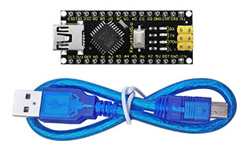

## Project 1: Keyestudio NANO CH340

**Introduction:**

The keyestudio Nano CH340 is a small, complete, and breadboard-friendly board based on the ATmega328P-AU. Compared with ARDUINO NANO, the USB-to-serial port chip used in keyestudio Nano is CH340G, so that the using method is the same except the driver installation file.

It has 14 digital input/output pins (of which 6 can be used as PWM outputs), 8 analog inputs, a 16 MHz crystal oscillator, a mini USB port, an ICSP header and a reset button.

The keyestudio Nano can be powered via the Mini-B USB connection, or female headers Vin/GND (DC 7-12V).

**Note:**

You can click the link to check out how to test the keyestudio Nano CH340: https://wiki.keyestudio.com/Ks0173_keyestudio_Nano_ch340

**TECH SPECS:**

|       Microcontroller       |                ATmega328P-AU                 |
| :-------------------------: | :------------------------------------------: |
|      Operating Voltage      |                      5V                      |
| Input Voltage (recommended) |                   DC7-12V                    |
|      Digital I/O Pins       | 14 (D0-D13)  (of which 6 provide PWM output) |
|    PWM Digital I/O Pins     |         6 (D3, D5, D6, D9, D10, D11)         |
|      Analog Input Pins      |                  8 (A0-A7)                   |
|   DC Current per I/O Pin    |                    40 mA                     |
|        Flash Memory         |    32 KB of which 2 KB used by bootloader    |
|            SRAM             |                     2 KB                     |
|           EEPROM            |                     1 KB                     |
|         Clock Speed         |                    16 MHz                    |
|         LED_BUILTIN         |                     D13                      |

**Element and Interfaces:**

Here is an explanation of what every element and interface of the board does:

|        |                  PIN                   | FUNCTION                                                     |
| ------ | :------------------------------------: | ------------------------------------------------------------ |
| **1**  |            **ICSP Header**             | **ICSP (In-Circuit Serial Programming) Header** ICSP is the AVR, an micro-program header consisting of MOSI, MISO, SCK, RESET, VCC, and GND. It is often called the SPI (serial peripheral interface) and can be considered an "extension" of output. In fact, slave the output devices under the SPI bus host. When connecting to PC, program the firmware to ATMEGA328P-AU. |
| **2**  |      **LED indicator** **（RX）**      | Onboard you can find the label: RX(receive ) When control board communicates via serial port, receive the message, RX led flashes. |
| **3**  |      **LED indicator** **（TX）**      | Onboard you can find the label: TX (transmit) When control board communicates via serial port, send the message, TX led flashes. |
| **4**  |     **LED indicator** **（POW）**      | Power up the control board, LED on, otherwise LED off.       |
| **5**  |      **LED indicator** **（L）**       | There is a built-in LED driven by digital pin 13. When the pin is HIGH value, the LED is on, when the pin is LOW, it's off. |
| **6**  | **RX0（D0）** **TX1（D1）** **D2-D13** | It has 14 digital input/output pins D0-D13 (of which 6 can be used as PWM outputs). These pins can be configured as digital input pin to read the logic value (0 or 1). Or used as digital output pin to drive different modules like LED, relay, etc. |
| **7**  |                **RST**                 | Reset pin: connect external button. The function is the same as RESET button. |
| **8**  |             **MEGA 328P**              | Each board has its own microcontroller. You can regard it as the brain of your board. Microcontrollers are usually from ATMEL. Before you load a new program on the Arduino IDE, you must know what IC is on your board. This information can be checked at the top surface of IC. The board’s microcontroller is ATMEGA328P-AU.  More info. see the [datasheet](http://101.96.10.64/ww1.microchip.com/downloads/en/DeviceDoc/Atmel-42735-8-bit-AVR-Microcontroller-ATmega328-328P_Summary.pdf) |
| **9**  |              **MINI USB**              | The board can be powered via Mini-B USB connection. Also upload the program to the board via USB port. |
| **10** |              **3V3 pin**               | Provides 3.3V voltage output                                 |
| **11** |                **REF**                 | Reference external voltage (0-5 volts) for the analog input pins. Used with [analogReference()](https://www.arduino.cc/reference/en/language/functions/analog-io/analogreference/). |
| **12** |               **A0-A7**                | The Nano has 8 Analog Pins, labeled A0 through A7.           |
| **13** |               **5V pin**               | Provides 5V voltage output                                   |
| **14** |                **GND**                 | Ground pin                                                   |
| **15** |                **VIN**                 | Input an external voltage DC7-12V to power the board.        |
| **16** |          **Reset** **Button**          | Used to reset the control board                              |
| **17** |               **CH340G**               | USB-to-serial port chip, converting the USB signal into Serial port signal. |
| **18** |              **AMS1117**               | Convert the external voltage input DC7-12V into DC5V, then transfer it to the processor and other elements. |

**Specialized Functions of Some Pins:**

-   **Serial communication:** 0 (RX) and 1 (TX). Used to receive (RX) and transmit (TX) TTL serial data.

-   **PWM (Pulse-Width Modulation):** D3, D5, D6, D9, D10, D11

-   **External Interrupts:** D2 (interrupt 0) and D3 (interrupt 1). These pins can be configured to trigger an interrupt on a low value, a rising or falling edge, or a change in value. See the attachInterrupt() function for details.

-   **SPI communication:** D10 (SS), D11 (MOSI), D12 (MISO), D13 (SCK).

-   **IIC communication:**  A4 (SDA); A5(SCL)