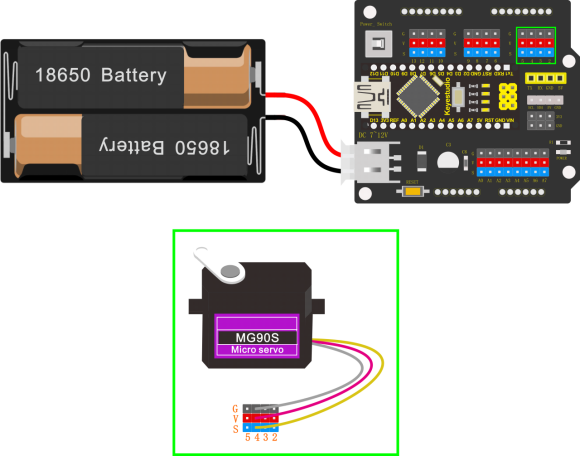

## Project 3: Adjusting Servo Angle

Introduction

In the process of frog robot DIY, the frog robot has a 180° servomotor at each joint. We can control the servomotor at each joint to rotate at different angles, thus controlling the frog robot to run different actions.

In this course we focus on the principle and usage of the servomotor in the frog robot kit.

The servomotor is a position servo driver that can rotate between 0 and 180 degrees. If you want your robot assistant to help you get a book, the robot arm rotation angle is too big or too small, so that can't pick up the book. Only the angle is just right, it can complete the task of taking the book, so can accurately control the angle.

Servo motor is a position control rotary actuator. It mainly consists of housing, circuit board, core-less motor, gear and position sensor.


Included with your servo motor you will find a variety of black mounts that connect to the shaft of your servo.

You may choose to attach any mount you wish for the circuit. It will serve as a visual aid, making it easier to see the servo spin.

**Working principle**

The receiver or MCU outputs a signal to the servomotor. The motor has a built-in reference circuit that gives out reference signal, cycle of 20ms and width of 1.5ms. The motor compares the acquired DC bias voltage to the voltage of the potentiometer and outputs a voltage difference.

Servo motor comes with many specifications. But all of them have three connection wires, distinguished by brown, red, orange colors (different brand may have different color).

Brown one is for GND, red one for power positive, orange one for signal line.


The rotation angle of servo motor is controlled by regulating the duty cycle of PWM (Pulse-Width Modulation) signal. The standard cycle of PWM signal is 20ms (50Hz).

Theoretically, the width is distributed between 1ms-2ms, but in fact, it's between 0.5ms-2.5ms. The width corresponds the rotation angle from 0° to 180°.

But note that for different brand motor, the same signal may have different rotation angle.


We can set the HIGH/LOW for corresponding pins in the Mixly blocks software, so as to adjust the servo angle; furthermore, we specially create the robot library, so easy to control the servo angle with simplified code.

**Connection Diagram**

Simply stack the keyestudio Nano ch340 into the keystudio NANO shield.

Connect the Servo pin to digital pin 4



**Source Code**

Test the angle that servo motor moves between 0°and 180°

```c
#include <Servo.h>

Servo servo_4; //Instantiate servos

void setup(){

servo_4.attach(4); //Connect the signal wire(yellow) to digital 4

}

void loop(){
	for (int i = 0; i <= 180; i = i + (1)) { //the variable i is used to save thelocation of the servo, from 0° to 180°，the step length is 1
		servo_4.write(i); //make the servo to rotate the location of variable i
		delay(200); //wait for 200ms to make the servo to rotate the location ofvariable i 
    }

	for (int i = 180; i >= 0; i = i + (-1)) { //the variable i is used to save the location of the servo, from 0° to 180°, the step length is 1
        servo_4.write(i); //make the servo to rotate the location of variable i
        delay(200); //wait for 200ms to make the servo to rotate the location of variable i 
    }
}
```

**Test Result**

Upload the Code success, press down the Power_Switch, the servo motor will rotate back and forth from 0°to 180°.

**Code explanation**

**\#include \<Servo.h\>**It is the Servo function and statement of Arduino.

1.  attach（port）——Set the port of the servo

2.  write（angle）——The statement used to set the rotation angle of the servo. The range of the angle that can be set is 0° to 180°.

3.  read（）——The statement used to read the angle of the steering gear can be understood as reading the value in the last write() command.attached（）——Determine whether the servo parameters have been sent to the interface where the servo is located.

4.  Note: the above statement writing format is servo variables names like myservo.attach(4)

**Extension Practice:**

Refer to the test code. Try to reset the servo pin and rotation speed (Tips: set the delay time for servo angle ; or adjust to increase/reduce the step, which should be divisible by 180, like 2, 3, 5.)


```c
#include <Servo.h>

Servo servo_4; //Instantiate servos

void setup(){
	servo_4.attach(4); //Connect the signal wire(yellow) to digital 4
}

void loop(){

	for (int i = 0; i <= 180; i = i + (1)) { //the variable i is used to save thelocation of the servo, from 0° to 180°， the step length is 1
		servo_4.write(i); //make the servo to rotate the location of variable i
		delay(1000); //wait for 1000ms, the servo rotate the location of the variable i
}

	for (int i = 180; i >= 0; i = i + (-1)) { //the variable i is used to save thelocation of the servo, from 0° to 180°, the step length is 1
	servo_4.write(i); //make the servo to rotate the location of variable i
	delay(1000); //wait for 1000ms, the servo rotate the location of the variable i
	}
}
```

```c
#include <Servo.h>

Servo servo_4; //Instantiate servos

void setup(){
	servo_4.attach(4); //Connect the signal wire(yellow) to digital 4
}

void loop(){
	for (int i = 0; i <= 180; i = i + (20)) { //the variable i is used to save thelocation of the servo, from 0° to 180°, the step length is 20
		servo_4.write(i); //make the servo to rotate the location of variable i
		delay(200);//wait for 200ms to make the servo to rotate the location of variable i 
    }

	for (int i = 180; i >= 0; i = i + (-20)) { //the variable i is used to save thelocation of the servo, from 0° to 180°, the step length is 20
		servo_4.write(i); //make the servo to rotate the location of variable i
		delay(200); //wait for 200ms to make the servo to rotate the location of variable i 
    }
}
```
