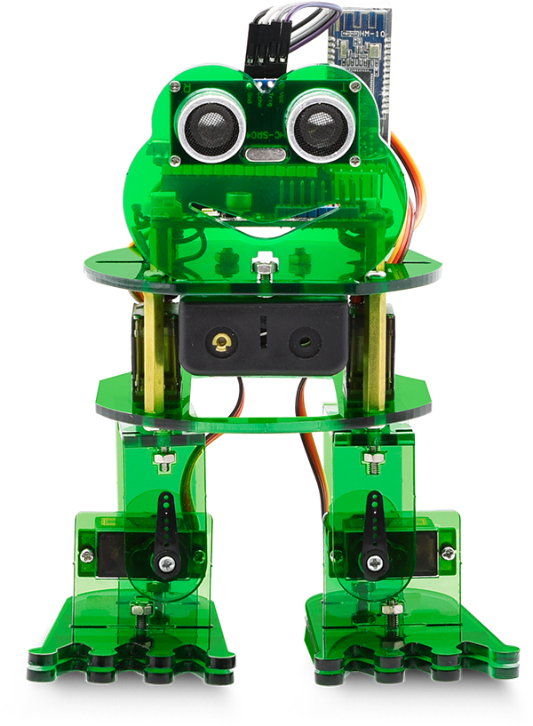
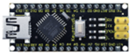
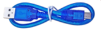
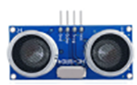
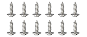
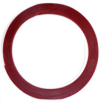

# **Keyestudio Frog Robot for Arduino**

# 1. Resources Download

 **Download the APP, Code and library from the link: <https://fs.keyestudio.com/KS0446>**

# 2. Overview

What an amazing Otto Frog Robot is coming!

This kit provides a perfect opportunity to build your very first robot, and it makes the process of learning about robotics easy, interactive, and FUN!

The kit is based on the keyestudio nano ch340, compatible with both Arduino open-source platform and Mixly Blocks coding.

You can program your own robot to walk, dance and follow obstacle, easy to build and code. No prior tech experience required!

Through play and experimentation children can exercise computational thinking and put skills into practice that are necessary for problem solving.

# 3. Features

-   Voltage input: DC 7-12V

-   Ultrasonic module for measuring the front obstacle distance, forming obstacle avoiding system;
    
-   Pairing HM-10 Bluetooth module with mobile Bluetooth to navigate the frog robot;
    
-   Providing the mobile APP compatible with both Android and mac system;

-   The NANO shield extends 12 digital pins and 8 analog pins into 3pin header, easy to connect a couple of sensor modules for projects extension;
    
-   The NANO shield comes with an I2C communication pin, able to connect I2C communication module for experiment extension.

# 4. Parts List

In this keyestudio frog robot kit package, you’ll receive all the components needed to build your own robot, easy to code and learn to play.

|  #   |                             NAME                             | QTY  |                             PIC                              |
| :--: | :----------------------------------------------------------: | :--: | :----------------------------------------------------------: |
|  1   |                    Keyestudio nano ch340                     |  1   |                      |
|  2   |      AM/mini5P transparent blue OD:5.0 L=30cm USB cable      |  1   |                      |
|  3   |                    keyestudio NANO shield                    |  1   |                      |
|  4   | Keyestudio HM-10 Bluetooth-4.0 V3 compatible with HC-06 pins |  1   |                      |
|  5   |                  HC-SR04 Ultrasonic sensor                   |  1   |                      |
|  6   |  18650 2-cell Battery case with JST-PH2.0MM-2P lead(115MM)   |  1   |  |
|  7   |                 M1.6\*10MM round-head screw                  |  4   |  |
|  8   |                 M1.6 304 stainless steel nut                 |  4   |               |
|  9   |                   M3\*6MM round-head screw                   |  16  |                                             |
|  10  |                  M3\*10MM round-head screw                   |  10  |               |
|  11  |                   M3\*10MM flat-head screw                   |  3   |               |
|  12  |                    M3 nickel plating nut                     |  14  |               |
|  13  |                  M2\*10MM round-head screw                   |  8   |               |
|  14  |                    M2 nickel plating nut                     |  12  |               |
|  15  |                    M1.2X5MM tapping screw                    |  12  |               |
|  16  |                   M3 304 self-locking nut                    |  2   |  |
|  17  |                      Dual-pass M3\*10MM                      |  4   |               |
|  18  |                      Dual-pass M3\*30MM                      |  4   |               |
|  19  | Acrylic plate 3PCS  215\*120MM T=3MM  transparent green environmental protection |  1   |                                         |
|  20  |         Servo MG90S（14g）23\*12.2\*29mm(black) 180°         |  4   |                                             |
|  21  |              Female to female 10CM Jumper wire               |  20  |  |
|  22  |      yellow and black Handle 3\*40MM cross screwdriver       |  1   |  |
|  23  |   Transparent red film acrylic double-sided adhesive tape    |  1   |  |
|  24  |                        Flange bearing                        |  2   |                      |

# 5. Install Arduino IDE and Driver

**Click the link to start learning how to download software, install drivers, upload code, and install library files.**

**[https://getting-started-with-arduino.readthedocs.io](https://getting-started-with-arduino.readthedocs.io/en/latest/Arduino%20IDE%20Tutorial.html)**
