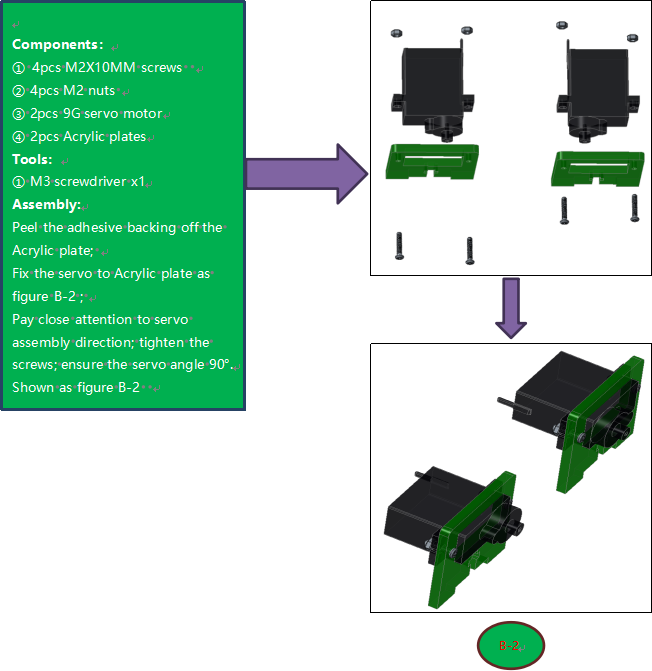
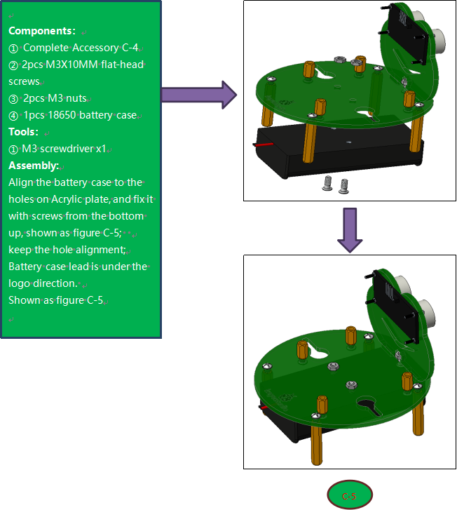
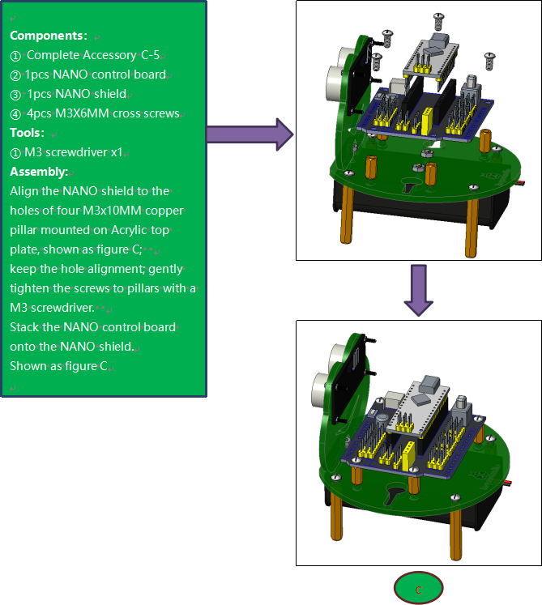
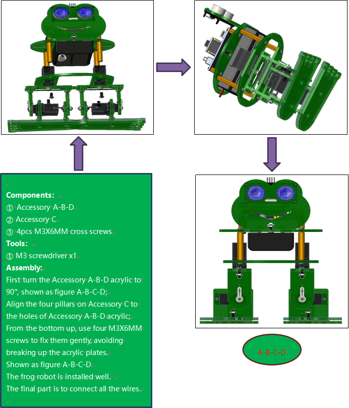

# ROBOT ASSEMBLY

All the parts for building frog robot are included in the kit, assembling them is easy and typically takes around two hours!


**Note:**

Before install the frog robot, first need to regulate the 4 servo motors to 90°

Stack the Nano ch340 onto the Nano shield; connect 4 servo motors to digital pin5,4,3,2 separately.


**Code:**

Upload the code below to turn the 4 servos to 90° (Refer to project 3)

```c
#include <Servo.h>

Servo servo_2; //Instantiate servos2
Servo servo_3; //Instantiate servos3
Servo servo_4; //Instantiate servos4
Servo servo_5; //Instantiate servos5

void setup(){
    servo_2.attach(2); //Connect the signal wire 2 to digital 2
    servo_3.attach(3); //Connect the signal wire 3 to digital 3
    servo_4.attach(4); //Connect the signal wire 4 to digital 4
    servo_5.attach(5); //Connect the signal wire 5 to digital 5
}

void loop(){
    servo_2.write(90); //Set the angle of the servo 2 to 90°
    delay(500); //Delay in 500ms
    servo_3.write(90); //Set the angle of the servo 3 to 90°
    delay(500); //Delay in 500ms
    servo_4.write(90); //set the angle of the servo 4 to 90°
    delay(500); //Delay in 500ms
    servo_5.write(90); //set the angle of the servo 5 to 90°
    delay(500); //Delay in 500ms
}
```

Fix Feet


Fix Legs





Fix Head to Body






Fix Servos to Body


Complete Frog




Wiring

Connect the HC-SR04 ultrasonic sensor to keyestudio NANO shield using 4pin female to female jumper wires. VCC pin to 5V(V), Trig pin to digital 6 (S), Echo pin to digital 7 (S), GND pin to GND(G);

(The ultrasonic sensor wiring can refer to the Project 4)

Connect the signal wire (orange) of 4 servo motors to digital pin5,4,3,2 separately; brown wire to GND(G); red wire to 5V (V).

(The 4 servos wiring can refer to the Project 3)


The 4 servo motors’ wiring figure:

Plug in the Keyestudio HM-10 Bluetooth-4.0 module to pin header TX, RX, GND, 5V on the keyestudio NANO shield.


## 