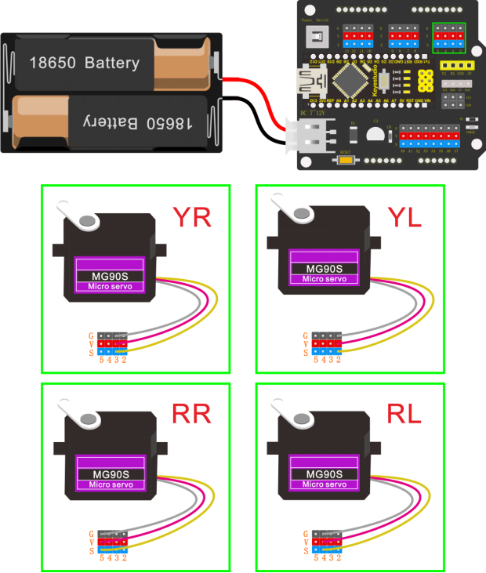

## Project 5: Walk


**Circuit Design**

After completing the robot assembly, you’ll see the 4 Servo motors on the robot are connected well to the keyestudio Nano ch340 shield.

We have introduced the knowledge of how to adjust the Servo angle.

In the circuit, we are going to make the 4 Servo motors switch different angles using keyestudio Nano ch340 shield, so as to operate the frog robot walk.

**How it works?**

When design the Otto frog robot, should first design the 4 Servo motors’ position and corresponding control pins.

Check the detailed instructions for servo control pins. As the figure shown below.

**Wiring:**

Simply stack the keyestudio Nano ch340 into the keystudio NANO shield.

Connect the Servo pin to digital pin 2, 3, 4, 5 separately.



**Coding:**

```c
#include <Servo.h>
#include <Oscillator.h>
#include <EEPROM.h>
#define N_SERVOS 4
//-- First step: Configure the pins where the servos are attached
/*
         ---------------
        |     O   O     |
        |---------------|
YR 3==> |               | <== YL 2
         ---------------
            ||     ||
            ||     ||
RR 5==>   -----   ------  <== RL 4
         |-----   ------|
*/
#define EEPROM_TRIM false

//Adjust the angle of the starting servo (Note: must be adjusted here)
#define TRIM_RR -5  //right02
#define TRIM_RL 5  //left02
#define TRIM_YR -5  //right01
#define TRIM_YL 0  //left01

//Servo pin
#define PIN_RR 5
#define PIN_RL 4
#define PIN_YR 3
#define PIN_YL 2
#define INTERVALTIME 10.0
Oscillator servo[N_SERVOS];

#include "SR04.h"
#define TRIG_PIN 6   //sending pins of the ultrasonic sensor
#define ECHO_PIN 7   //receiving pins of the ultrasonic sensorSR04 
SR04 sr04 = SR04(ECHO_PIN,TRIG_PIN);
long a;
int i = 0;  
int val = 0;

//each function declaration
void goingUp(int tempo);
void drunk (int tempo);
void noGravity(int tempo);
void kickLeft(int tempo);
void kickRight(int tempo);
void run(int steps, int T=500);
void walk(int steps, int T=1000);
void backyard(int steps, int T=3000);
void backyardSlow(int steps, int T=5000);
void turnLeft(int steps, int T=3000);
void turnRight(int steps, int T=3000);
void moonWalkLeft(int steps, int T=1000);
void moonWalkRight(int steps, int T=1000);
void crusaito(int steps, int T=1000);
void swing(int steps, int T=1000);
void upDown(int steps, int T=1000);
void flapping(int steps, int T=1000);

int t=495;
double pause=0;

//stop
void Stop()
{
  for(int i=0;i<4;i++) servo[i].SetPosition(90);
}

//go back
 void backyard(int steps, int T)
{
  int A[4]= {15, 15, 30, 30};
  int O[4] = {0, 0, 0, 0};
  double phase_diff[4] = {DEG2RAD(0), DEG2RAD(0), DEG2RAD(-90), DEG2RAD(-90)};
  for(int i=0;i<steps;i++)oscillate(A,O, T, phase_diff);
}

//turn left
 void turnLeft(int steps, int T)
{
  int A[4]= {20, 20, 10, 30};
  int O[4] = {0, 0, 0, 0};
  double phase_diff[4] = {DEG2RAD(0), DEG2RAD(0), DEG2RAD(90), DEG2RAD(90)};
  for(int i=0;i<steps;i++)oscillate(A,O, T, phase_diff);
}

//turn right
 void turnRight(int steps, int T)
{
  int A[4]= {20, 20, 30, 10};
  int O[4] = {0, 0, 0, 0};
  double phase_diff[4] = {DEG2RAD(0), DEG2RAD(0), DEG2RAD(90), DEG2RAD(90)};
  for(int i=0;i<steps;i++)oscillate(A,O, T, phase_diff);
}

//go forward
 void walk(int steps, int T)
{
  int A[4]= {15, 15, 30, 30};
  int O[4] = {0, 0, 0, 0};
  double phase_diff[4] = {DEG2RAD(0), DEG2RAD(0), DEG2RAD(90), DEG2RAD(90)};
  for(int i=0;i<steps;i++)oscillate(A,O, T, phase_diff);
}

void oscillate(int A[N_SERVOS], int O[N_SERVOS], int T, double phase_diff[N_SERVOS]){
  for (int i=0; i<4; i++) {
    servo[i].SetO(O[i]);
    servo[i].SetA(A[i]);
    servo[i].SetT(T);
    servo[i].SetPh(phase_diff[i]);
  }
  double ref=millis();
   for (double x=ref; x<T+ref; x=millis()){
     for (int i=0; i<4; i++){
        servo[i].refresh();
     }
  }
}

unsigned long final_time;
unsigned long interval_time;
int oneTime;
int iteration;
float increment[N_SERVOS];
int oldPosition[]={90,90,90,90};

void moveNServos(int time, int  newPosition[]){
  for(int i=0;i<N_SERVOS;i++) increment[i] = ((newPosition[i])-oldPosition[i])/(time/INTERVALTIME);
  final_time =  millis() + time;
  iteration = 1;
  while(millis() < final_time){ //Javi del futuro cambia esto
      interval_time = millis()+INTERVALTIME;
      oneTime=0;
      while(millis()<interval_time){
          if(oneTime<1){
              for(int i=0;i<N_SERVOS;i++){
                  servo[i].SetPosition(oldPosition[i] + (iteration * increment[i]));
              }
              iteration++;
              oneTime++;
          }
      }
  }

  for(int i=0;i<N_SERVOS;i++){
    oldPosition[i] = newPosition[i];
  }
}

void setup(){
  Serial.begin(9600);
  servo[0].attach(PIN_RR);
  servo[1].attach(PIN_RL);
  servo[2].attach(PIN_YR);
  servo[3].attach(PIN_YL);
  int trim;
  if(EEPROM_TRIM){
    for(int x=0;x<4;x++){
      trim=EEPROM.read(x);
      if(trim>128)trim=trim-256;
      Serial.print("TRIM ");
      Serial.print(x);
      Serial.print(" en ");
      Serial.println(trim);
      servo[x].SetTrim(trim);
    }
  }
  else{
    servo[0].SetTrim(TRIM_RR);
    servo[1].SetTrim(TRIM_RL);
    servo[2].SetTrim(TRIM_YR);
    servo[3].SetTrim(TRIM_YL);
  }
  for(int i=0;i<4;i++) servo[i].SetPosition(90);
}

void loop(){
  walk(5,2*t);  //Take 5 steps forward at a speed of 2*t
  backyard(5,2*t);  //Take 5 steps back at a speed of 2*t
  Stop();    //stop
  delay(1000); //Delay in 1000ms
  turnLeft(5,2*t);  // turn left for five steps in 2*t
  turnRight(5,2*t);  //turn right for five steps in  2*t
  Stop();    //stop
  delay(1000);  //Delay in 1000ms
}

```

**Note:** should upload the code success first, then plug in Bluetooth module. Otherwise, code upload fails.

**Result**

Done uploading the code, press down the Power_Switch on Nano Shield.

The Otto frog robot is ready to walk 5 steps forward, back 5 steps, keep standing for 1 second, turn left for 5 steps, turn right for 5 steps, keep standing for 1 second, alternately and loop.


