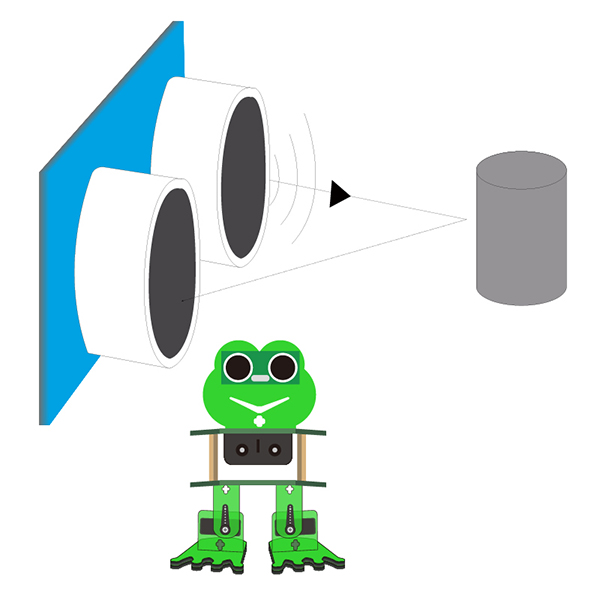

## Project 7: Follow



**Circuit Design**

In the above sections, we have introduced how to use ultrasonic sensor to detect the front obstacle distance. We also operate the multiple style movements of frog robot.

In this circuit, we can first measure the distance of obstacle ahead with ultrasonic sensor, then navigate the robot’s movement style by distance value, so as to achieve the follow function.

**The specific logic of ultrasonic follow is as shown below:**


Based on the circuit design, we can start making robot follow obstacles with ultrasonic sensor. Follow the wiring diagram and test code below.

**Wiring**

Stack the Nano ch340 onto the Nano shield; connect ultrasonic sensor to Nano shield, VCC pin to 5V(V), Trig pin to digital 6 (S), Echo pin to digital 7 (S), GND pin to GND(G). Connect 4 servo motors to digital pin5,4,3,2 separately.


**Coding**

```c
#include <Servo.h>
#include <Oscillator.h>
#include <EEPROM.h>
#define N_SERVOS 4
//-- First step: Configure the pins where the servos are attached
/*
         ---------------
        |     O   O     |
        |---------------|
YR 3==> |               | <== YL 2
         ---------------
            ||     ||
            ||     ||
RR 5==>   -----   ------  <== RL 4
         |-----   ------|
*/
#define EEPROM_TRIM false

//adjust the initial angles of servos
#define TRIM_RR (-5)  //right02
#define TRIM_RL 5  //left02
#define TRIM_YR (-5)  //right01
#define TRIM_YL 0  //left01

//pins of the servo
#define PIN_RR 5
#define PIN_RL 4
#define PIN_YR 3
#define PIN_YL 2
#define INTERVALTIME 10.0
Oscillator servo[N_SERVOS];

#include "SR04.h"
#define TRIG_PIN 6  //sending pins of the ultrasonic sensor
#define ECHO_PIN 7  //receiving pins of the ultrasonic sensor
SR04 sr04 = SR04(ECHO_PIN,TRIG_PIN);
long a;
int i = 0;
int val = 0;

//each function declaration
void goingUp(int tempo);
void drunk (int tempo);
void noGravity(int tempo);
void kickLeft(int tempo);
void kickRight(int tempo);
void run(int steps, int T=500);
void walk(int steps, int T=1000);
void backyard(int steps, int T=3000);
void backyardSlow(int steps, int T=5000);
void turnLeft(int steps, int T=3000);
void turnRight(int steps, int T=3000);
void moonWalkLeft(int steps, int T=1000);
void moonWalkRight(int steps, int T=1000);
void crusaito(int steps, int T=1000);
void swing(int steps, int T=1000);
void upDown(int steps, int T=1000);
void flapping(int steps, int T=1000);

int t=495;
double pause=0;

volatile int distance;  //Integer variable used to store the distance value received by the ultrasonic sensor

//stop
void Stop()
{
  for(int i=0;i<4;i++) servo[i].SetPosition(90);
}

//go back
 void backyard(int steps, int T)
{
  int A[4]= {15, 15, 30, 30};
  int O[4] = {0, 0, 0, 0};
  double phase_diff[4] = {DEG2RAD(0), DEG2RAD(0), DEG2RAD(-90), DEG2RAD(-90)};
  for(int i=0;i<steps;i++)oscillate(A,O, T, phase_diff);
}

//go forward
 void walk(int steps, int T)
{
  int A[4]= {15, 15, 30, 30};
  int O[4] = {0, 0, 0, 0};
  double phase_diff[4] = {DEG2RAD(0), DEG2RAD(0), DEG2RAD(90), DEG2RAD(90)};
  for(int i=0;i<steps;i++)oscillate(A,O, T, phase_diff);
}

void oscillate(int A[N_SERVOS], int O[N_SERVOS], int T, double phase_diff[N_SERVOS]){
  for (int i=0; i<4; i++) {
    servo[i].SetO(O[i]);
    servo[i].SetA(A[i]);
    servo[i].SetT(T);
    servo[i].SetPh(phase_diff[i]);
  }
  double ref=millis();
   for (double x=ref; x<T+ref; x=millis()){
     for (int i=0; i<4; i++){
        servo[i].refresh();
     }
  }
}

unsigned long final_time;
unsigned long interval_time;
int oneTime;
int iteration;
float increment[N_SERVOS];
int oldPosition[]={90,90,90,90};

void moveNServos(int time, int  newPosition[]){
  for(int i=0;i<N_SERVOS;i++) increment[i] = ((newPosition[i])-oldPosition[i])/(time/INTERVALTIME);
  final_time =  millis() + time;
  iteration = 1;
  while(millis() < final_time){ //Javi del futuro cambia esto
      interval_time = millis()+INTERVALTIME;
      oneTime=0;
      while(millis()<interval_time){
          if(oneTime<1){
              for(int i=0;i<N_SERVOS;i++){
                  servo[i].SetPosition(oldPosition[i] + (iteration * increment[i]));
              }
              iteration++;
              oneTime++;
          }
      }
  }

  for(int i=0;i<N_SERVOS;i++){
    oldPosition[i] = newPosition[i];
  }
}

float checkdistance() {  //distance measuring function
  //Generate a 10us high pulse to trigger TrigPin
  digitalWrite(6, LOW);  //Set pin 6 output voltage low
  delayMicroseconds(2);  //delay in 20ms
  digitalWrite(6, HIGH);  //Set pin 6 output voltage high
  delayMicroseconds(10);  //delay in 10ms
  digitalWrite(6, LOW);  //Set pin 6 output voltage low
  // Detect pulse width and calculate distance
  float distance = pulseIn(7, HIGH) / 58.00; // Read the high-level pulse on pin 7, divide the maximum pulse time by 58.00, and assign the result to the distance variable as a floating value  delay(10);  // delay in 10ms
  return distance;  //return the distance value
}

void setup(){
  distance = 0;
  Serial.begin(9600);
  Serial.begin(9600);
  servo[0].attach(PIN_RR);
  servo[1].attach(PIN_RL);
  servo[2].attach(PIN_YR);
  servo[3].attach(PIN_YL);
  int trim;
  if(EEPROM_TRIM){
    for(int x=0;x<4;x++){
      trim=EEPROM.read(x);
      if(trim>128)trim=trim-256;
      Serial.print("TRIM ");
      Serial.print(x);
      Serial.print(" en ");
      Serial.println(trim);
      servo[x].SetTrim(trim);
    }
  }
  else{
    servo[0].SetTrim(TRIM_RR);
    servo[1].SetTrim(TRIM_RL);
    servo[2].SetTrim(TRIM_YR);
    servo[3].SetTrim(TRIM_YL);
  }
  for(int i=0;i<4;i++) servo[i].SetPosition(90);
  pinMode(6, OUTPUT);    //Initialize digital pin 6 to output mode, connect to Trig of ultrasonic sensor
  pinMode(7, INPUT);     //set the digital 7 to output, and connect the Eco of the ultrasonic sensor
  Serial.begin(9600);     //open the serial port, set the data transmission speed to 9600bps
}

void loop(){
  distance = checkdistance();  //Assign the value of checkdistance() to the variable distance
  Serial.println(distance);  //output checkdistance via the serial port()
  if (distance > 20 && distance < 60) {  //if distance > 20 and distance < 60
    walk(1,2*t);  //move forward for 1 step in 2*t

  } else if (distance > 10 && distance <= 20) {  //or else distance > 10 and distance <= 20
    Stop();      //stop
  } else if (distance <= 10) {  //or else distance <= 10 
    backyard(1,2*t);  //go back  for 1 step in 2*t 
  } else {  //or above conditions are not met
    Stop();  //stop

  }

}

```

(**Note:** should upload the code success first, then plug in Bluetooth module. Otherwise, code upload fails.)

**Result**

Done uploading the code, press down the Power_Switch on Nano Shield.

The Otto frog robot will move along with the front obstacle.


